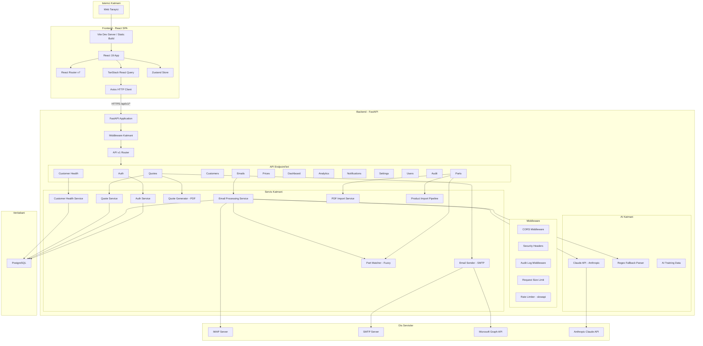
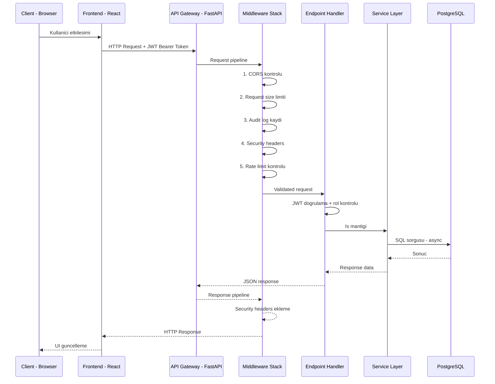
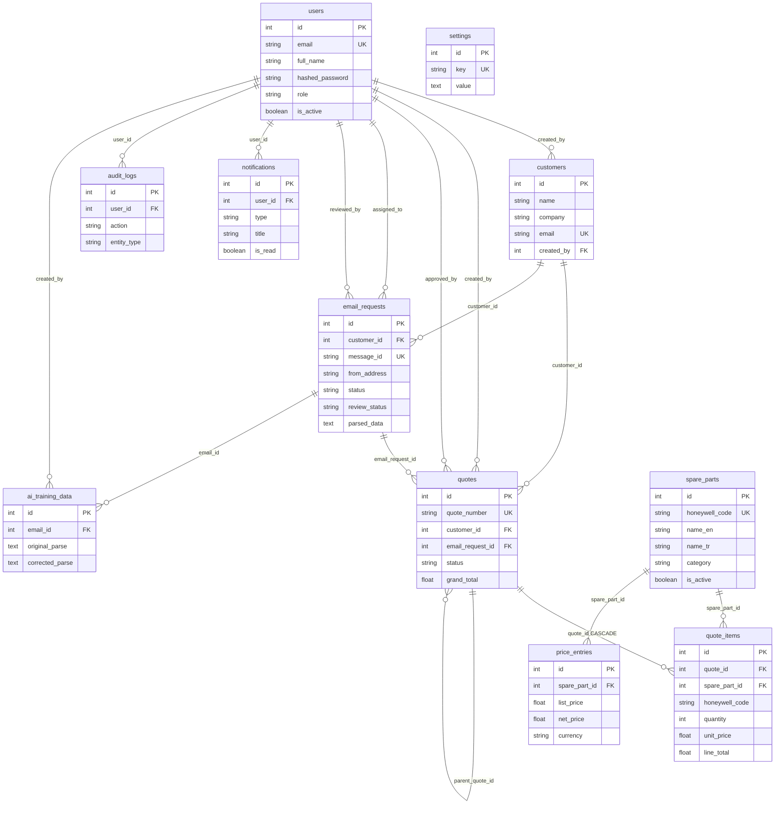
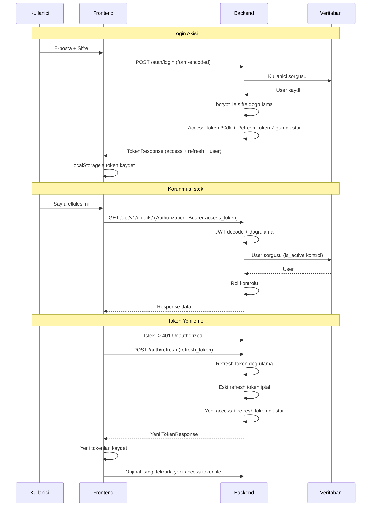
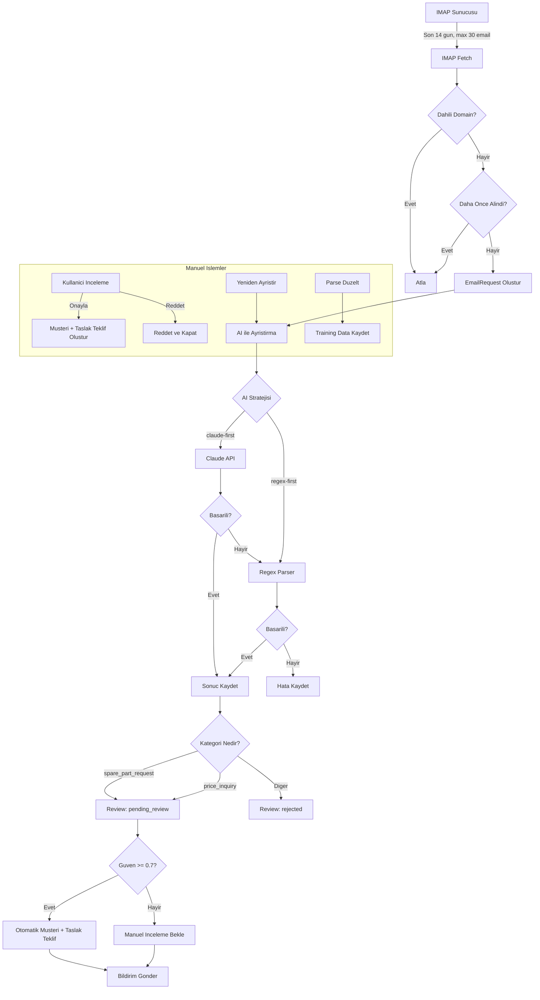
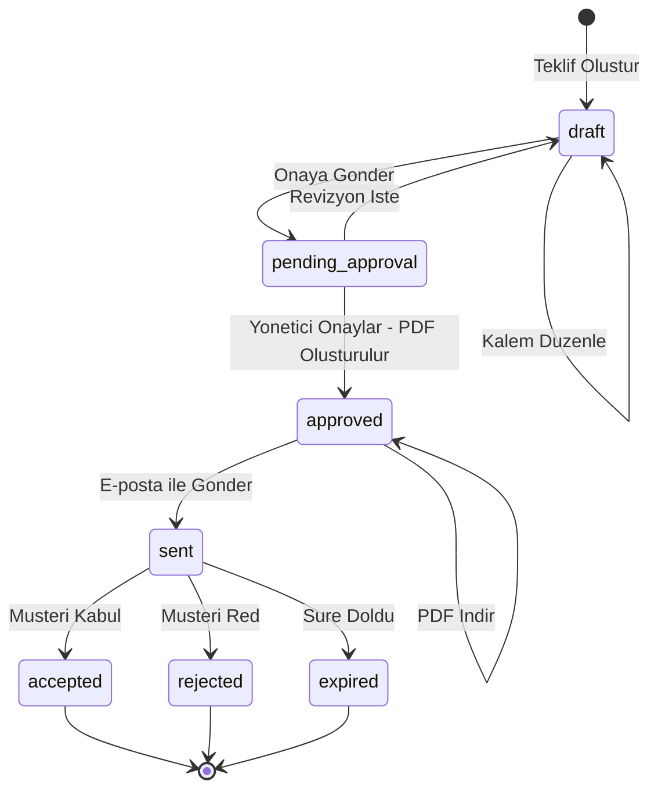
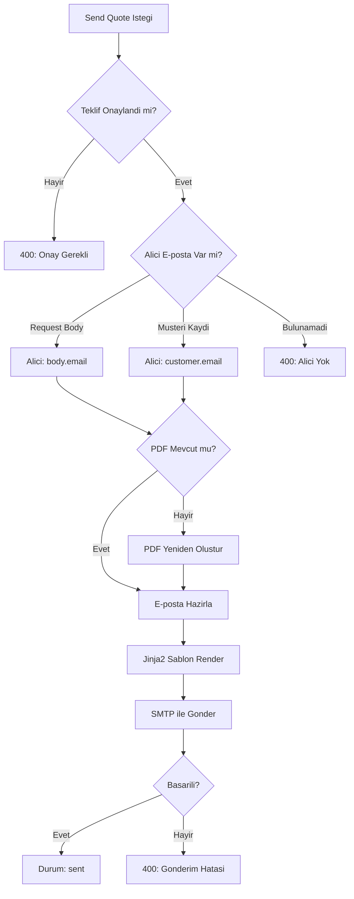
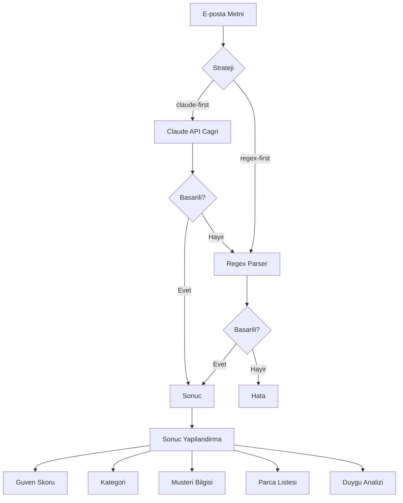
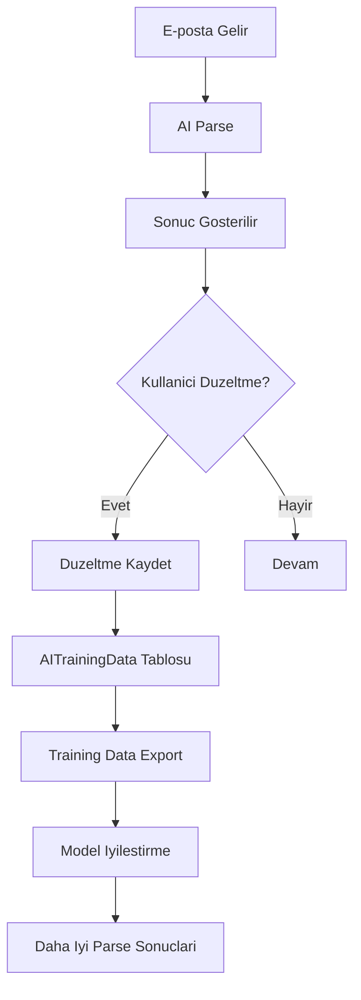
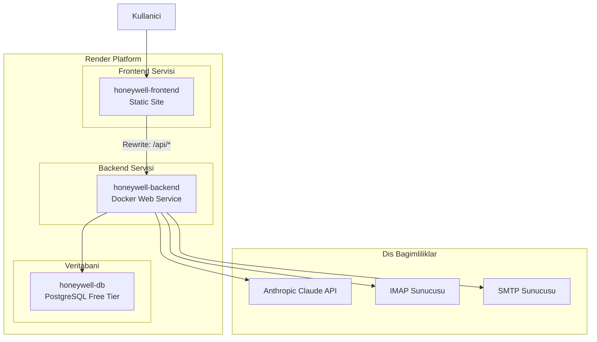

# Honeywell Sales Manager - Teknik Dokumantasyon

**Versiyon:** 1.0.0
**Son Guncelleme:** 2026-03-30
**Durum:** Uretim Ortaminda Aktif

---

## Icerik Tablosu

1. [Proje Ozeti](#1-proje-ozeti)
2. [PRD (Urun Gereksinimleri Dokumani)](#2-prd-urun-gereksinimleri-dokumani)
3. [Tech Stack](#3-tech-stack)
4. [Sistem Mimarisi](#4-sistem-mimarisi)
5. [Veritabani Semasi](#5-veritabani-semasi)
6. [API Referansi](#6-api-referansi)
7. [Frontend Mimarisi](#7-frontend-mimarisi)
8. [Kimlik Dogrulama ve Yetkilendirme](#8-kimlik-dogrulama-ve-yetkilendirme)
9. [Email Islem Pipeline'i](#9-email-islem-pipelinei)
10. [Teklif Pipeline'i](#10-teklif-pipelinei)
11. [AI Sistemi](#11-ai-sistemi)
12. [Guvenlik Ozellikleri](#12-guvenlik-ozellikleri)
13. [Deployment Mimarisi](#13-deployment-mimarisi)
14. [Ortam Degiskenleri](#14-ortam-degiskenleri)
15. [Test Altyapisi](#15-test-altyapisi)

---

## 1. Proje Ozeti

### 1.1 Projenin Amaci

Honeywell Sales Manager, Honeywell Turkiye'nin yedek parca satis surecini uctan uca yoneten bir web uygulamasidir. Sistem, musterilerden gelen e-posta taleplerini yapay zeka destekli parser ile otomatik olarak analiz eder, talep edilen yedek parcalari katalogdan eslestirir, teklif hazirlayip PDF olarak olusturur ve musteriye e-posta ile gonderir.

### 1.2 Hedef Kitle

| Rol | Aciklama |
|-----|----------|
| **Satis Yoneticisi (sales_manager)** | Tum sisteme tam erisim. Kullanici yonetimi, teklif onaylama, raporlama ve denetim loglarina erisim. |
| **Satis Temsilcisi (sales_rep)** | E-posta yonetimi, musteri yonetimi, teklif hazirlama. Kendi olusturdugu teklifleri gorur. |
| **Operasyon (operations)** | Yedek parca katalogu ve fiyat listesi yonetimi. Urun import/export islemleri. |

### 1.3 Temel Yetenekler

- **AI Destekli E-posta Analizi:** Claude AI ile gelen e-postalarin otomatik siniflandirilmasi, yedek parca taleplerinin cikarilmasi ve guven skoru hesaplanmasi.
- **Yedek Parca Katalogu:** Honeywell kodlari, coklu dil destegi (TR/EN), kategorilendirme, fuzzy matching ile eslesme.
- **Teklif Yonetimi:** Taslak olusturma, kalem duzenleme, onay akisi, PDF uretimi (WeasyPrint), e-posta ile gonderim.
- **Musteri Saglik Skoru:** Musterilerin aktivite durumunu izleyen, risk altindaki musterileri tespit eden skor sistemi.
- **Analitik ve Raporlama:** En cok talep edilen parcalar, aylik trendler, kategori dagilimi, AI kullanim istatistikleri.
- **Denetim Loglari (Audit Trail):** Tum durum degistiren islemlerin otomatik olarak kaydedilmesi.
- **Bildirim Sistemi:** Uygulama ici bildirimler, okunmamis bildirim sayaci.
- **Coklu E-posta Saglayici Destegi:** Gmail, Outlook, Yahoo, Yandex ve kurumsal e-posta sunuculari icin otomatik IMAP/SMTP algilama.

---

## 2. PRD (Urun Gereksinimleri Dokumani)

### 2.1 Kullanici Hikayeleri

#### Satis Temsilcisi Olarak

| ID | Hikaye | Oncelik |
|----|--------|---------|
| US-01 | E-posta kutumu baglamak icin IMAP bilgilerimi girebilmeliyim, boylece sistem otomatik olarak e-postalari cekebilsin. | Yuksek |
| US-02 | Gelen e-postalari listeleyebilmeliyim ve her birinin AI tarafindan ayristirilmis parca taleplerini gorebilmeliyim. | Yuksek |
| US-03 | Bir e-postadan tek tikla teklif taslagi olusturabilmeliyim. | Yuksek |
| US-04 | Teklif kalemlerini duzenleyebilmeliyim (miktar, birim fiyat, indirim yuzdeleri). | Yuksek |
| US-05 | Musterileri manuel olarak ekleyebilmeliyim veya Excel/CSV dosyasindan toplu import yapabilmeliyim. | Orta |
| US-06 | Yedek parca katalogundan arama yapabilmeliyim (kod, isim, kategori). | Orta |
| US-07 | AI'in yanlis ayristirdigi verileri duzeltebilmeliyim ve bu duzeltmeler egitim verisi olarak kaydedilsin. | Orta |
| US-08 | E-postalari okundu olarak isaretleyebilmeliyim. | Dusuk |
| US-09 | Manuel e-posta girisi yapabilmeliyim (telefonla alinan talepler icin). | Orta |

#### Satis Yoneticisi Olarak

| ID | Hikaye | Oncelik |
|----|--------|---------|
| US-10 | Beklemedeki teklifleri onaylayabilmeliyim. Onay sonrasi PDF otomatik olusturulsun. | Yuksek |
| US-11 | Onaylanan teklifi musteriye e-posta ile gonderebilmeliyim. | Yuksek |
| US-12 | Dashboard uzerinden toplam e-posta, teklif, musteri ve donusum oranini gorebilmeliyim. | Yuksek |
| US-13 | Aylik gelir trendi ve en cok talep edilen parcalari raporlayabilmeliyim. | Orta |
| US-14 | Yeni kullanicilar olusturabilmeliyim ve rol atayabilmeliyim. | Yuksek |
| US-15 | Kullanicilari aktif/pasif yapabilmeliyim ve son aktif yoneticinin deaktif edilmesi engellensin. | Yuksek |
| US-16 | Denetim loglarini gorebilmeliyim (kim, ne zaman, ne yapti). | Orta |
| US-17 | E-postalari inceleyip onaylayabilmeliyim (approve) veya reddedebilmeliyim (reject). | Yuksek |
| US-18 | Musteri saglik skorlarini gorebilmeliyim ve risk altindaki musterileri tespit edebilmeliyim. | Orta |
| US-19 | AI kullanim istatistiklerini gorebilmeliyim (parse sayisi, duzeltme orani, tahmini maliyet). | Dusuk |

#### Operasyon Kullanicisi Olarak

| ID | Hikaye | Oncelik |
|----|--------|---------|
| US-20 | Yedek parca katalogu ekleyebilmeliyim, guncelleyebilmeliyim ve silebilmeliyim (soft delete). | Yuksek |
| US-21 | Excel/CSV/PDF dosyasindan toplu parca import edebilmeliyim. | Yuksek |
| US-22 | Fiyat listesi girebilmeliyim ve guncelleyebilmeliyim (list_price, net_price, gecerlilik tarihleri). | Yuksek |
| US-23 | Fiyat listesini Excel/CSV'den toplu import edebilmeliyim. | Orta |

### 2.2 Fonksiyonel Gereksinimler

| ID | Gereksinim | Detay |
|----|-----------|-------|
| FR-01 | Kimlik Dogrulama | JWT tabanli (access + refresh token). OAuth2 uyumlu login. |
| FR-02 | Rol Tabanli Erisim Kontrolu (RBAC) | 3 rol: sales_rep, sales_manager, operations. Her endpoint'te rol kontrolu. |
| FR-03 | E-posta Cekme | IMAP uzerinden son 14 gunun e-postalarini cekme. Gunluk 2 poll limiti. |
| FR-04 | AI ile E-posta Ayristirma | Claude API ile parca kodu, musteri adi, kategori, guven skoru cikarma. |
| FR-05 | E-posta Siniflandirma | spare_part_request, price_inquiry, general_inquiry, complaint kategorileri. |
| FR-06 | Teklif Yasamdongusu | draft -> pending_approval -> approved -> sent -> accepted/rejected/expired |
| FR-07 | PDF Olusturma | WeasyPrint + Jinja2 sablon ile profesyonel teklif PDF'i uretimi. |
| FR-08 | E-posta Gonderimi | SMTP veya Microsoft Graph API uzerinden teklif PDF'i ek olarak gonderim. |
| FR-09 | Parca Eslestirme | Fuzzy matching (rapidfuzz) ile e-postadaki taleplerin katalogla eslestirilmesi. |
| FR-10 | Toplu Import | Excel (.xlsx), CSV (.csv) ve PDF dosyalarindan musteri, parca ve fiyat import. |
| FR-11 | Bildirim Sistemi | Uygulama ici bildirimler, okunmamis sayaci, toplu okundu isaretleme. |
| FR-12 | Denetim Loglari | Tum POST, PUT, PATCH, DELETE islemlerinin otomatik loglenmasi. |
| FR-13 | Musteri Saglik Skoru | Cok boyutlu skor hesaplama (satin alma sikligi, teklif degeri, aktivite). |
| FR-14 | Ayarlar Yonetimi | Teklif on eki, vergi orani, para birimi, gecerlilik suresi yapilandirmasi. |
| FR-15 | Sifre Yonetimi | Sifre guclulusu dogrulama, zorunlu sifre degistirme, bcrypt hashleme. |

### 2.3 Fonksiyonel Olmayan Gereksinimler

| ID | Gereksinim | Hedef |
|----|-----------|-------|
| NFR-01 | Performans | API yanit suresi < 500ms (P95). Dashboard yuklenme < 2 saniye. |
| NFR-02 | Guvenlik | JWT token suresi 30dk access / 7 gun refresh. Rate limiting 100/dk API, 5/dk login. |
| NFR-03 | Olceklenebilirlik | Stateless backend, Docker container destegi, yatay olcekleme. |
| NFR-04 | Kullanilabilirlik | Turkce UI. Karanlik/aydinlik tema destegi. Responsive tasarim. |
| NFR-05 | Guvenilirlik | Uretim ortaminda Swagger/ReDoc kapali. CSP header'lari. Sifre sifreleme (Fernet). |
| NFR-06 | Uyumluluk | PostgreSQL 14+, Python 3.11+, Node.js 18+. |
| NFR-07 | Yuklenme Boyutu | Maksimum dosya yukleme: 10 MB. Izin verilen uzantilar: .csv, .xlsx, .xls. |
| NFR-08 | Coklu Dil | Frontend 5 dil destegi (tr, en, de, fr, es). Backend siniflandirma dil algilama. |
| NFR-09 | Erisilebilirlik | Font boyutu ayarlanabilir (-4 ile +4 arasi). Karanlik mod destegi. |

---

## 3. Tech Stack

### 3.1 Backend

| Teknoloji | Versiyon | Amac |
|-----------|---------|------|
| Python | 3.11 | Runtime |
| FastAPI | 0.115.6 | Web framework |
| Uvicorn | 0.34.0 | ASGI server |
| SQLAlchemy | 2.0.36 | ORM (async) |
| asyncpg | 0.30.0 | PostgreSQL async driver |
| Alembic | 1.14.0 | Veritabani migration |
| Pydantic | 2.10.3 | Veri dogrulama |
| pydantic-settings | 2.7.0 | Ortam degiskeni yonetimi |
| python-jose | 3.3.0 | JWT token islemleri |
| passlib + bcrypt | 1.7.4 / 4.0.1 | Sifre hashleme |
| Anthropic SDK | 0.40.0 | Claude AI entegrasyonu |
| MSAL | 1.31.0 | Microsoft Graph API |
| httpx | 0.28.1 | Async HTTP client |
| rapidfuzz | 3.10.1 | Fuzzy string matching |
| WeasyPrint | 63.1 | HTML -> PDF donusumu |
| Jinja2 | 3.1.4 | Sablon motoru |
| aiosmtplib | 3.0.2 | Async SMTP e-posta gonderimi |
| slowapi | 0.1.9 | Rate limiting |
| cryptography | 44.0.0 | Fernet sifreleme |
| APScheduler | 3.10.4 | Arkaplan gorev zamanlayici |
| pandas | 2.2.3 | Veri isleme |
| openpyxl | 3.1.5 | Excel dosya okuma/yazma |
| pdfplumber | 0.11.4 | PDF veri cikarma |
| numpy | >= 1.24.0 | Sayisal islemler |

### 3.2 Frontend

| Teknoloji | Versiyon | Amac |
|-----------|---------|------|
| React | 19.2.4 | UI framework |
| TypeScript | ~5.9.3 | Tip guvenligi |
| Vite | 8.0.1 | Build araci ve dev server |
| React Router DOM | 7.13.2 | Istemci tarafi yonlendirme |
| TanStack React Query | 5.95.2 | Sunucu durumu yonetimi ve onbellekleme |
| Zustand | 5.0.12 | Istemci durumu yonetimi |
| Axios | 1.14.0 | HTTP istemcisi |
| Tailwind CSS | 4.2.2 | Utility-first CSS framework |
| React Hook Form | 7.72.0 | Form yonetimi |
| Zod | 4.3.6 | Sema dogrulama |
| @hookform/resolvers | 5.2.2 | Zod + React Hook Form entegrasyonu |
| Recharts | 3.8.1 | Grafik ve gorsellistirme |
| Lucide React | 1.7.0 | Ikon kutuphanesi |
| Sonner | 2.0.7 | Toast bildirimleri |
| @dnd-kit | 6.3.1 / 10.0.0 | Surukle-birak islevselligi |
| js-cookie | 3.0.5 | Cookie yonetimi |

### 3.3 Test

| Teknoloji | Versiyon | Amac |
|-----------|---------|------|
| Vitest | 4.1.2 | Frontend test runner |
| @testing-library/react | 16.3.2 | React component testleri |
| @testing-library/jest-dom | 6.9.1 | DOM assertion yardimcilari |
| @testing-library/user-event | 14.6.1 | Kullanici etkilesim simulasyonu |
| jsdom | 29.0.1 | Tarayici ortami simulasyonu |
| pytest | 8.3.4 | Backend test runner |
| pytest-asyncio | 0.24.0 | Async test destegi |

### 3.4 Altyapi

| Teknoloji | Amac |
|-----------|------|
| Docker | Backend konteynerizasyonu |
| Render | Bulut hosting platformu |
| PostgreSQL | Iliskisel veritabani |
| Render Blueprint (render.yaml) | Deklaratif deploy yapilandirmasi |

---

## 4. Sistem Mimarisi

### 4.1 Genel Mimari Diyagrami



### 4.2 Istek Yasam Dongusu



---

## 5. Veritabani Semasi

### 5.1 Tablo Genel Bakisi

Sistem toplam 11 veritabani tablosu icerir. Tum tablolar SQLAlchemy 2.0 `Mapped` column tanimlari ile olusturulur ve `create_all` ile uygulama baslangicindan otomatik olusturulur.

### 5.2 Tablo Detaylari

#### 5.2.1 `users`

Kullanici hesaplarini temsil eder.

| Sutun | Tip | Kisitlamalar | Varsayilan | Aciklama |
|-------|-----|-------------|-----------|----------|
| `id` | Integer | PK, AUTO_INCREMENT | - | Birincil anahtar |
| `email` | String(255) | UNIQUE, NOT NULL, INDEX | - | Kullanici e-posta adresi |
| `full_name` | String(255) | NOT NULL | - | Tam isim |
| `hashed_password` | String(255) | NOT NULL | - | bcrypt ile hashlenmiş sifre |
| `role` | String(20) | NOT NULL | `"sales_rep"` | Kullanici rolu (sales_rep, sales_manager, operations) |
| `is_active` | Boolean | - | `True` | Hesap aktif mi |
| `email_setup_completed` | Boolean | - | `False` | E-posta baglantisi yapildi mi |
| `password_change_required` | Boolean | - | `False` | Zorunlu sifre degistirme gerekli mi |
| `created_at` | DateTime(tz) | - | `now(utc)` | Olusturulma zamani |
| `updated_at` | DateTime(tz) | - | `now(utc)` | Son guncelleme zamani |

#### 5.2.2 `customers`

Musterileri temsil eder.

| Sutun | Tip | Kisitlamalar | Varsayilan | Aciklama |
|-------|-----|-------------|-----------|----------|
| `id` | Integer | PK, AUTO_INCREMENT | - | Birincil anahtar |
| `name` | String(255) | NOT NULL | - | Musteri adi |
| `company` | String(255) | NULL | - | Sirket adi |
| `email` | String(255) | UNIQUE, NOT NULL, INDEX | - | E-posta adresi |
| `phone` | String(50) | NULL | - | Telefon numarasi |
| `address` | Text | NULL | - | Adres |
| `tax_id` | String(50) | NULL | - | Vergi numarasi |
| `preferred_lang` | String(5) | - | `"tr"` | Tercih edilen dil |
| `created_by` | Integer | FK -> users.id, NULL | - | Olusturan kullanici |
| `created_at` | DateTime(tz) | - | `now(utc)` | Olusturulma zamani |
| `updated_at` | DateTime(tz) | - | `now(utc)` | Son guncelleme zamani |

**Iliskiler:**
- `quotes`: One-to-Many -> Quote (back_populates="customer")
- `email_requests`: One-to-Many -> EmailRequest (back_populates="customer")

#### 5.2.3 `email_requests`

Gelen e-posta taleplerini ve AI ayristirma sonuclarini saklar.

| Sutun | Tip | Kisitlamalar | Varsayilan | Aciklama |
|-------|-----|-------------|-----------|----------|
| `id` | Integer | PK, AUTO_INCREMENT | - | Birincil anahtar |
| `customer_id` | Integer | FK -> customers.id, NULL | - | Iliskili musteri |
| `message_id` | String(255) | UNIQUE, NOT NULL, INDEX | - | E-posta Message-ID header'i |
| `from_address` | String(255) | NOT NULL | - | Gonderen adresi |
| `subject` | String(500) | NULL | - | E-posta konusu |
| `body_text` | Text | NULL | - | Duz metin govdesi |
| `body_html` | Text | NULL | - | HTML govdesi |
| `language` | String(5) | NULL | - | Algilanan dil |
| `received_at` | DateTime(tz) | NULL | - | Alinan zaman |
| `status` | String(20) | INDEX | `"new"` | Islem durumu: new, parsed, quoted, sent, error |
| `parsed_data` | Text | NULL | - | AI ayristirma sonucu (JSON) |
| `error_message` | Text | NULL | - | Hata mesaji |
| `category` | String(50) | NULL | - | E-posta kategorisi |
| `category_confidence` | Float | NULL | - | Kategori guven skoru (0.0-1.0) |
| `price_sensitivity` | Boolean | NULL | - | Fiyat hassasiyeti var mi |
| `sentiment` | String(20) | NULL | - | Duygu analizi sonucu |
| `sentiment_score` | Float | NULL | - | Duygu skoru |
| `is_duplicate` | Boolean | NULL | - | Tekrar e-posta mi |
| `duplicate_of_id` | Integer | NULL | - | Tekrar ettigi e-posta ID |
| `is_read` | Boolean | - | `False` | Okundu olarak isaretlendi mi |
| `last_parsed_at` | DateTime(tz) | NULL | - | Son ayristirma zamani |
| `review_status` | String(20) | NULL | - | Inceleme durumu: pending_review, approved, rejected |
| `assigned_to` | Integer | FK -> users.id, NULL | - | Atanan kullanici |
| `reviewed_by` | Integer | FK -> users.id, NULL | - | Inceleyen kullanici |
| `created_at` | DateTime(tz) | - | `now(utc)` | Olusturulma zamani |

**Iliskiler:**
- `customer`: Many-to-One -> Customer (back_populates="email_requests")

#### 5.2.4 `spare_parts`

Honeywell yedek parca katalogu.

| Sutun | Tip | Kisitlamalar | Varsayilan | Aciklama |
|-------|-----|-------------|-----------|----------|
| `id` | Integer | PK, AUTO_INCREMENT | - | Birincil anahtar |
| `honeywell_code` | String(500) | UNIQUE, NOT NULL, INDEX | - | Honeywell parca kodu |
| `name_en` | Text | NULL | - | Ingilizce isim |
| `name_tr` | Text | NULL | - | Turkce isim |
| `description_en` | Text | NULL | - | Ingilizce aciklama |
| `description_tr` | Text | NULL | - | Turkce aciklama |
| `category` | String(200) | NULL, INDEX | - | Kategori |
| `subcategory` | String(200) | NULL | - | Alt kategori |
| `keywords_json` | Text | NULL | - | Arama anahtar kelimeleri (JSON array) |
| `aliases_json` | Text | NULL | - | Alternatif isimler (JSON array) |
| `info` | Text | NULL | - | Ek bilgi |
| `model_number` | String(200) | NULL, INDEX | - | Model numarasi |
| `transfer_price` | Float | NULL | - | Transfer fiyati |
| `supplier_price` | Float | NULL | - | Tedarikci fiyati |
| `price_currency` | String(10) | NULL | - | Fiyat para birimi |
| `is_active` | Boolean | - | `True` | Aktif mi (soft delete) |
| `created_at` | DateTime(tz) | - | `now(utc)` | Olusturulma zamani |

**Iliskiler:**
- `prices`: One-to-Many -> PriceEntry (back_populates="spare_part")

#### 5.2.5 `price_entries`

Yedek parcalara ait fiyat listesi kayitlari.

| Sutun | Tip | Kisitlamalar | Varsayilan | Aciklama |
|-------|-----|-------------|-----------|----------|
| `id` | Integer | PK, AUTO_INCREMENT | - | Birincil anahtar |
| `spare_part_id` | Integer | FK -> spare_parts.id, NOT NULL, INDEX | - | Iliskili yedek parca |
| `list_price` | Float | NOT NULL | - | Liste fiyati |
| `discount_pct` | Float | - | `0.0` | Indirim yuzdesi |
| `net_price` | Float | NOT NULL | - | Net fiyat |
| `currency` | String(10) | - | `"USD"` | Para birimi |
| `valid_from` | Date | NULL | - | Gecerlilik baslangic tarihi |
| `valid_until` | Date | NULL | - | Gecerlilik bitis tarihi |
| `price_list_version` | String(50) | NULL | - | Fiyat listesi versiyonu |
| `created_at` | DateTime(tz) | - | `now(utc)` | Olusturulma zamani |

**Iliskiler:**
- `spare_part`: Many-to-One -> SparePart (back_populates="prices")

#### 5.2.6 `quotes`

Fiyat tekliflerini temsil eder.

| Sutun | Tip | Kisitlamalar | Varsayilan | Aciklama |
|-------|-----|-------------|-----------|----------|
| `id` | Integer | PK, AUTO_INCREMENT | - | Birincil anahtar |
| `quote_number` | String(50) | UNIQUE, NOT NULL, INDEX | - | Teklif numarasi (orn: HW-2026-001) |
| `customer_id` | Integer | FK -> customers.id, NULL | - | Iliskili musteri |
| `email_request_id` | Integer | FK -> email_requests.id, NULL | - | Kaynak e-posta talebi |
| `created_by` | Integer | FK -> users.id, NULL | - | Olusturan kullanici |
| `approved_by` | Integer | FK -> users.id, NULL | - | Onaylayan kullanici |
| `status` | String(20) | INDEX | `"draft"` | Durum: draft, pending_approval, approved, sent, accepted, rejected, expired |
| `language` | String(5) | - | `"tr"` | Teklif dili |
| `currency` | String(10) | - | `"TRY"` | Para birimi |
| `subtotal` | Float | - | `0.0` | Ara toplam |
| `discount_total` | Float | - | `0.0` | Toplam indirim |
| `tax_rate` | Float | - | `20.0` | Vergi orani (%) |
| `tax_amount` | Float | - | `0.0` | Vergi tutari |
| `grand_total` | Float | - | `0.0` | Genel toplam |
| `valid_days` | Integer | - | `30` | Gecerlilik suresi (gun) |
| `notes` | Text | NULL | - | Notlar |
| `pdf_path` | String(500) | NULL | - | Olusturulan PDF dosya yolu |
| `version` | Integer | - | `1` | Teklif versiyonu |
| `parent_quote_id` | Integer | FK -> quotes.id, NULL | - | Ust teklif (revizyon) |
| `created_at` | DateTime(tz) | - | `now(utc)` | Olusturulma zamani |
| `updated_at` | DateTime(tz) | - | `now(utc)` | Son guncelleme zamani |

**Iliskiler:**
- `customer`: Many-to-One -> Customer (back_populates="quotes")
- `items`: One-to-Many -> QuoteItem (cascade="all, delete-orphan")

#### 5.2.7 `quote_items`

Teklif kalemlerini temsil eder.

| Sutun | Tip | Kisitlamalar | Varsayilan | Aciklama |
|-------|-----|-------------|-----------|----------|
| `id` | Integer | PK, AUTO_INCREMENT | - | Birincil anahtar |
| `quote_id` | Integer | FK -> quotes.id (CASCADE), NOT NULL, INDEX | - | Iliskili teklif |
| `spare_part_id` | Integer | FK -> spare_parts.id, NULL | - | Eslesen yedek parca |
| `original_text` | Text | NULL | - | E-postadaki orijinal metin |
| `honeywell_code` | String(100) | NULL | - | Honeywell parca kodu |
| `description` | String(500) | NULL | - | Kalem aciklamasi |
| `quantity` | Integer | - | `1` | Miktar |
| `unit_price` | Float | - | `0.0` | Birim fiyat |
| `discount_pct` | Float | - | `0.0` | Indirim yuzdesi |
| `line_total` | Float | - | `0.0` | Satir toplami |
| `match_score` | Float | NULL | - | Eslestirme skoru (0.0-1.0) |
| `match_strategy` | String(50) | NULL | - | Eslestirme stratejisi (exact, fuzzy, ai) |
| `is_confirmed` | Boolean | - | `False` | Kullanici tarafindan onaylandi mi |
| `sort_order` | Integer | - | `0` | Siralama |

**Iliskiler:**
- `quote`: Many-to-One -> Quote (back_populates="items")
- `spare_part`: Many-to-One -> SparePart

#### 5.2.8 `notifications`

Uygulama ici bildirimleri saklar.

| Sutun | Tip | Kisitlamalar | Varsayilan | Aciklama |
|-------|-----|-------------|-----------|----------|
| `id` | Integer | PK, AUTO_INCREMENT | - | Birincil anahtar |
| `user_id` | Integer | FK -> users.id, NOT NULL, INDEX | - | Hedef kullanici |
| `type` | String(50) | NOT NULL | - | Bildirim tipi |
| `title` | String(255) | NOT NULL | - | Bildirim basligi |
| `message` | Text | NULL | - | Bildirim icerigi |
| `is_read` | Boolean | - | `False` | Okundu mu |
| `entity_type` | String(50) | NULL | - | Iliskili varlik tipi (email, quote, vb.) |
| `entity_id` | Integer | NULL | - | Iliskili varlik ID |
| `created_at` | DateTime(tz) | - | `now(utc)` | Olusturulma zamani |

#### 5.2.9 `audit_logs`

Denetim loglarini saklar. AuditLogMiddleware tarafindan otomatik olarak olusturulur.

| Sutun | Tip | Kisitlamalar | Varsayilan | Aciklama |
|-------|-----|-------------|-----------|----------|
| `id` | Integer | PK, AUTO_INCREMENT | - | Birincil anahtar |
| `user_id` | Integer | FK -> users.id, NULL | - | Islemi yapan kullanici |
| `action` | String(50) | NOT NULL | - | Islem tipi (CREATE, UPDATE, DELETE) |
| `entity_type` | String(50) | NOT NULL, INDEX | - | Etkilenen varlik tipi |
| `entity_id` | Integer | NOT NULL | - | Etkilenen varlik ID |
| `changes` | Text | NULL | - | Degisiklik detaylari (JSON) |
| `ip_address` | String(50) | NULL | - | Istemci IP adresi |
| `created_at` | DateTime(tz) | - | `now(utc)` | Islem zamani |

#### 5.2.10 `settings`

Anahtar-deger ciftleri olarak uygulama ayarlarini saklar.

| Sutun | Tip | Kisitlamalar | Varsayilan | Aciklama |
|-------|-----|-------------|-----------|----------|
| `id` | Integer | PK, AUTO_INCREMENT | - | Birincil anahtar |
| `key` | String(100) | UNIQUE, NOT NULL, INDEX | - | Ayar anahtari |
| `value` | Text | NULL | - | Ayar degeri |
| `updated_at` | DateTime(tz) | - | `now(utc)` | Son guncelleme zamani |

#### 5.2.11 `ai_training_data`

Kullanici duzeltmelerinden olusan AI egitim verisini saklar.

| Sutun | Tip | Kisitlamalar | Varsayilan | Aciklama |
|-------|-----|-------------|-----------|----------|
| `id` | Integer | PK, AUTO_INCREMENT | - | Birincil anahtar |
| `email_id` | Integer | FK -> email_requests.id, NOT NULL, INDEX | - | Kaynak e-posta |
| `original_parse` | Text | NOT NULL | - | Orijinal AI ayristirma sonucu (JSON) |
| `corrected_parse` | Text | NOT NULL | - | Duzeltilmis ayristirma sonucu (JSON) |
| `correction_fields` | String(255) | NOT NULL | - | Duzeltilen alanlar (virgul ayirikli) |
| `model_used` | String(20) | - | `"claude"` | Kullanilan model (claude, regex) |
| `created_by` | Integer | FK -> users.id, NULL | - | Duzeltmeyi yapan kullanici |
| `created_at` | DateTime(tz) | - | `now(utc)` | Olusturulma zamani |

### 5.3 Iliski Diyagrami



---

## 6. API Referansi

Tum endpoint'ler `/api/v1` on eki altinda yer alir. Uretim ortaminda Swagger UI (`/docs`) ve ReDoc (`/redoc`) kapalidir.

### 6.1 Saglik Kontrolu

| Method | Path | Auth | Aciklama |
|--------|------|------|----------|
| `GET` | `/api/health` | Yok | Servis saglik kontrolu |

**Response:**
```json
{
  "status": "healthy",
  "service": "honeywell-sales-manager"
}
```

---

### 6.2 Kimlik Dogrulama (Auth)

#### POST `/api/v1/auth/login`

OAuth2 uyumlu giris. Rate limit: 5/dakika.

| Parametre | Tip | Zorunlu | Aciklama |
|-----------|-----|---------|----------|
| `username` | string (form) | Evet | E-posta adresi |
| `password` | string (form) | Evet | Sifre |

**Content-Type:** `application/x-www-form-urlencoded`

**Basarili Response (200):**
```json
{
  "access_token": "eyJhbGciOiJIUzI1NiIs...",
  "refresh_token": "eyJhbGciOiJIUzI1NiIs...",
  "token_type": "bearer",
  "password_change_required": false,
  "user": {
    "id": 1,
    "email": "admin@honeywell.com",
    "full_name": "Admin User",
    "role": "sales_manager",
    "is_active": true,
    "email_setup_completed": false
  }
}
```

**Hata Response'lari:**
- `401`: Gecersiz e-posta veya sifre
- `403`: Hesap devre disi
- `429`: Cok fazla deneme (rate limit)

---

#### POST `/api/v1/auth/register`

Yeni kullanici olusturur. Yalnizca `sales_manager` rolune sahip kullanicilar erisebilir.

**Auth:** Bearer Token (sales_manager)

**Request Body:**
```json
{
  "email": "user@honeywell.com",
  "password": "SecureP@ss123",
  "full_name": "Yeni Kullanici",
  "role": "sales_rep"
}
```

**Response (200):** UserResponse objesi

---

#### GET `/api/v1/auth/me`

Mevcut kullanicinin bilgilerini dondurur.

**Auth:** Bearer Token (herhangi bir rol)

**Response (200):** UserResponse objesi

---

#### POST `/api/v1/auth/refresh`

Refresh token ile yeni access token ve refresh token alir. Eski refresh token iptal edilir (token rotation).

**Request Body:**
```json
{
  "refresh_token": "eyJhbGciOiJIUzI1NiIs..."
}
```

**Response (200):** TokenResponse objesi

---

#### POST `/api/v1/auth/logout`

Refresh token'i iptal eder.

**Auth:** Bearer Token

**Request Body:**
```json
{
  "refresh_token": "eyJhbGciOiJIUzI1NiIs..."
}
```

**Response (200):**
```json
{
  "message": "Logged out successfully"
}
```

---

#### POST `/api/v1/auth/change-password`

Mevcut kullanicinin sifresini degistirir.

**Auth:** Bearer Token

**Request Body:**
```json
{
  "current_password": "EskiSifre123",
  "new_password": "YeniGucluSifre456!"
}
```

**Response (200):**
```json
{
  "message": "Password changed successfully"
}
```

---

### 6.3 Dashboard

#### GET `/api/v1/dashboard/stats`

Dashboard KPI verilerini dondurur.

**Auth:** Bearer Token (herhangi bir rol)

**Response (200):**
```json
{
  "total_emails": 150,
  "parsed_emails": 120,
  "total_quotes": 80,
  "sent_quotes": 45,
  "total_parts": 500,
  "total_customers": 30,
  "conversion_rate": 56.25,
  "avg_response_hours": 0.0,
  "pending_review_count": 5,
  "pending_value": 125000.50,
  "answered_emails": 45,
  "total_parts_value": 500000.00,
  "answered_parts_value": 250000.00,
  "total_parts_count": 1200,
  "answered_parts_count": 600,
  "approved_quotes": 50
}
```

---

### 6.4 E-postalar (Emails)

#### GET `/api/v1/emails/`

E-postalari sayfalama ve filtreleme ile listeler.

**Auth:** Bearer Token (sales_rep, sales_manager)

| Parametre | Tip | Varsayilan | Aciklama |
|-----------|-----|-----------|----------|
| `page` | int | 1 | Sayfa numarasi (1-10000) |
| `page_size` | int | 20 | Sayfa boyutu (1-100) |
| `is_read` | bool | null | Okunma durumu filtresi |
| `status` | string | null | Islem durumu filtresi (new, parsed, quoted, sent, error) |
| `review_status` | string | null | Inceleme durumu filtresi (pending_review, approved, rejected) |
| `category` | string | null | Kategori filtresi |
| `search` | string | null | Konu veya gonderen adresi arama |

**Response (200):** `PaginatedResponse<EmailRequest>`

---

#### GET `/api/v1/emails/{email_id}`

E-posta detayi (body dahil).

**Auth:** Bearer Token (sales_rep, sales_manager)

**Response (200):** EmailRequest objesi (body_text, body_html, parsed_data dahil)

---

#### POST `/api/v1/emails/manual`

Manuel e-posta girisi. Otomatik olarak AI ayristirmasi tetiklenir.

**Auth:** Bearer Token (sales_rep, sales_manager)

**Request Body:**
```json
{
  "from_address": "musteri@firma.com",
  "subject": "Yedek Parca Talebi",
  "body_text": "Merhabalar, 1055-001 kodlu parcadan 5 adet talep ediyoruz."
}
```

**Response (201):** EmailRequest objesi

---

#### POST `/api/v1/emails/poll`

IMAP uzerinden son 14 gunun e-postalarini ceker. Gunluk 2 poll limiti vardir.

**Auth:** Bearer Token (sales_rep, sales_manager)

**Response (200):**
```json
{
  "message": "3 yeni email alindi (son 14 gun)",
  "fetched_count": 3
}
```

**Hata Response'lari:**
- `400`: Gunluk limit doldu (max 2/gun)
- `400`: Email bilgileri ayarlanmamis

---

#### PATCH `/api/v1/emails/{email_id}/read`

E-postayi okundu olarak isaretler.

**Auth:** Bearer Token

**Response (200):**
```json
{
  "message": "OK"
}
```

---

#### POST `/api/v1/emails/{email_id}/reparse`

E-postayi Claude AI ile yeniden ayristirir. Gunluk 2 reparse limiti vardir.

**Auth:** Bearer Token (sales_rep, sales_manager)

**Response (200):**
```json
{
  "message": "Email 42 ayristirildi",
  "status": "parsed"
}
```

---

#### PATCH `/api/v1/emails/{email_id}/correct-parse`

AI ayristirma sonucunu manuel olarak duzeltir. Duzeltme, egitim verisi olarak kaydedilir.

**Auth:** Bearer Token (sales_rep, sales_manager)

**Request Body:**
```json
{
  "parsed_data": {
    "customer_name": "Ahmet Yilmaz",
    "customer_company": "ABC Ltd.",
    "parts": [
      {
        "part_code": "1055-001",
        "part_description": "Sensor",
        "quantity": 5,
        "urgency": "normal"
      }
    ],
    "category": "spare_part_request",
    "is_spare_part_request": true
  }
}
```

**Response (200):**
```json
{
  "message": "Duzeltme kaydedildi (2 alan)",
  "changed_fields": ["customer_name", "parts"]
}
```

---

#### GET `/api/v1/emails/training-data`

AI egitim verisini disa aktarir.

**Auth:** Bearer Token (sales_manager)

| Parametre | Tip | Varsayilan | Aciklama |
|-----------|-----|-----------|----------|
| `page` | int | 1 | Sayfa numarasi |
| `page_size` | int | 50 | Sayfa boyutu (1-200) |
| `model_used` | string | null | Model filtresi (claude, regex) |
| `field` | string | null | Duzeltilen alan filtresi |
| `format` | string | "json" | Cikti formati (json, jsonl) |

**Response (200):**
```json
{
  "count": 15,
  "page": 1,
  "page_size": 50,
  "data": [
    {
      "id": 1,
      "email_id": 42,
      "original_parse": {},
      "corrected_parse": {},
      "correction_fields": ["parts", "customer_name"],
      "model_used": "claude",
      "created_at": "2026-03-15T10:30:00Z"
    }
  ]
}
```

---

#### GET `/api/v1/emails/{email_id}/matches`

Ayristirilmis e-posta icin parca eslestirme sonuclarini dondurur.

**Auth:** Bearer Token (sales_rep, sales_manager)

**Response (200):**
```json
{
  "email_id": 42,
  "status": "parsed",
  "parsed_data": {},
  "matches": []
}
```

---

#### PATCH `/api/v1/emails/{email_id}/review`

E-postayi onaylar veya reddeder. Onay durumunda otomatik olarak musteri ve taslak teklif olusturulur.

**Auth:** Bearer Token (sales_manager)

**Request Body:**
```json
{
  "action": "approve"
}
```

`action` degerleri: `"approve"` veya `"reject"`

**Response (200):** EmailRequest objesi

---

### 6.5 Yedek Parcalar (Parts)

#### GET `/api/v1/parts/`

Yedek parcalari sayfalama ve arama ile listeler.

**Auth:** Bearer Token (herhangi bir rol)

| Parametre | Tip | Varsayilan | Aciklama |
|-----------|-----|-----------|----------|
| `page` | int | 1 | Sayfa numarasi |
| `page_size` | int | 20 | Sayfa boyutu |
| `search` | string | null | Kod, model veya isim aramasi |
| `category` | string | null | Kategori filtresi |

**Response (200):** `PaginatedResponse<SparePart>`

---

#### GET `/api/v1/parts/categories`

Aktif parcalarin benzersiz kategorilerini listeler.

**Auth:** Bearer Token

**Response (200):**
```json
["Sensors", "Valves", "Controllers", "Actuators"]
```

---

#### GET `/api/v1/parts/{part_id}`

Parca detayi (fiyat listesi dahil).

**Auth:** Bearer Token

**Response (200):** SparePart objesi + `prices` dizisi

---

#### POST `/api/v1/parts/`

Yeni yedek parca olusturur.

**Auth:** Bearer Token (operations)

**Request Body:**
```json
{
  "honeywell_code": "1055-001",
  "name_en": "Temperature Sensor",
  "name_tr": "Sicaklik Sensoru",
  "category": "Sensors",
  "subcategory": "Temperature"
}
```

**Response (201):** SparePart objesi

---

#### PUT `/api/v1/parts/{part_id}`

Yedek parca bilgilerini gunceller.

**Auth:** Bearer Token (operations)

**Guncellenebilir Alanlar:** `honeywell_code`, `model_number`, `info`, `name_en`, `name_tr`, `description_en`, `description_tr`, `category`, `subcategory`, `transfer_price`, `supplier_price`, `keywords_json`, `aliases_json`

**Response (200):** SparePart objesi

---

#### DELETE `/api/v1/parts/{part_id}`

Yedek parcayi soft delete yapar (`is_active=False`).

**Auth:** Bearer Token (operations)

**Response (200):**
```json
{
  "message": "Part 42 deactivated"
}
```

---

#### POST `/api/v1/parts/import`

Excel (.xlsx), CSV (.csv), JSON (.json) veya PDF (.pdf) dosyasindan toplu parca import.

**Auth:** Bearer Token (operations, sales_manager)

**Content-Type:** `multipart/form-data`

| Parametre | Tip | Aciklama |
|-----------|-----|----------|
| `file` | File | Import dosyasi |

**Desteklenen Dosya Tipleri:**
- `.csv`, `.xlsx`, `.xls`: Tablo bazli import
- `.json`: JSON bazli import
- `.pdf`: PDF tablosundan parca cikarma (pdfplumber)

**Response (201):**
```json
{
  "parts_created": 15,
  "parts_updated": 3,
  "source": "pdf",
  "total_extracted": 18
}
```

---

### 6.6 Fiyatlar (Prices)

#### GET `/api/v1/prices/`

Fiyat kayitlarini sayfalama ve filtreleme ile listeler.

**Auth:** Bearer Token

| Parametre | Tip | Varsayilan | Aciklama |
|-----------|-----|-----------|----------|
| `page` | int | 1 | Sayfa numarasi |
| `page_size` | int | 20 | Sayfa boyutu |
| `spare_part_id` | int | null | Parca filtresi |
| `currency` | string | null | Para birimi filtresi |

**Response (200):** `PaginatedResponse<PriceEntry>`

---

#### POST `/api/v1/prices/`

Yeni fiyat kaydi olusturur.

**Auth:** Bearer Token (operations)

**Request Body:**
```json
{
  "spare_part_id": 42,
  "list_price": 150.00,
  "discount_pct": 10.0,
  "net_price": 135.00,
  "currency": "USD",
  "valid_from": "2026-01-01",
  "valid_until": "2026-12-31",
  "price_list_version": "2026-Q1"
}
```

**Response (201):** PriceEntry objesi

---

#### POST `/api/v1/prices/import`

Excel veya CSV dosyasindan toplu fiyat import.

**Auth:** Bearer Token (operations)

**Content-Type:** `multipart/form-data`

**Gerekli Sutunlar:** `honeywell_code`, `list_price`, `net_price`
**Opsiyonel Sutunlar:** `discount_pct`, `currency`, `valid_from`, `valid_until`, `price_list_version`

**Response (201):**
```json
{
  "message": "Import completed",
  "imported": 50,
  "skipped": 3,
  "errors": ["Row 15: Part 'XYZ-999' not found"]
}
```

---

### 6.7 Musteriler (Customers)

#### GET `/api/v1/customers/`

Musterileri sayfalama ve arama ile listeler. Teklif istatistikleri dahildir.

**Auth:** Bearer Token

| Parametre | Tip | Varsayilan | Aciklama |
|-----------|-----|-----------|----------|
| `page` | int | 1 | Sayfa numarasi |
| `page_size` | int | 20 | Sayfa boyutu |
| `search` | string | null | Isim, sirket veya e-posta aramasi |

**Response (200):**
```json
{
  "items": [
    {
      "id": 1,
      "name": "Ahmet Yilmaz",
      "company": "ABC Ltd.",
      "email": "ahmet@abc.com",
      "quote_count": 5,
      "total_quote_value": 25000.00
    }
  ],
  "total": 30,
  "page": 1,
  "page_size": 20,
  "pages": 2
}
```

---

#### GET `/api/v1/customers/{customer_id}`

Musteri detayi (teklif istatistikleri dahil).

**Auth:** Bearer Token

**Response (200):** Customer objesi + `stats` (total_quotes, total_value, sent_quotes)

---

#### POST `/api/v1/customers/`

Yeni musteri olusturur. E-posta benzersizlik kontrolu yapilir.

**Auth:** Bearer Token (sales_rep, sales_manager)

**Request Body:**
```json
{
  "name": "Ahmet Yilmaz",
  "email": "ahmet@abc.com",
  "company": "ABC Ltd.",
  "phone": "+90 212 555 0000",
  "address": "Istanbul, Turkey",
  "tax_id": "1234567890",
  "preferred_lang": "tr"
}
```

**Response (201):** Customer objesi

---

#### PUT `/api/v1/customers/{customer_id}`

Musteri bilgilerini gunceller. E-posta degistiyse benzersizlik kontrolu yapilir.

**Auth:** Bearer Token (sales_rep, sales_manager)

**Response (200):** Customer objesi

---

#### DELETE `/api/v1/customers/{customer_id}`

Musteriyi siler. Yalnizca teklifi olmayan musteriler silinebilir.

**Auth:** Bearer Token (sales_manager)

**Response (200):**
```json
{
  "message": "Musteri 42 silindi"
}
```

---

#### POST `/api/v1/customers/import`

Excel (.xlsx) veya CSV (.csv) dosyasindan toplu musteri import. Mevcut e-postalar atlanir.

**Auth:** Bearer Token (sales_rep, sales_manager)

**Content-Type:** `multipart/form-data`

**Gerekli Sutunlar:** `name`, `email`
**Opsiyonel Sutunlar:** `company`, `phone`, `address`, `tax_id`, `preferred_lang`

**Dosya Boyut Limiti:** 5 MB

**Response (201):**
```json
{
  "message": "Import completed",
  "imported": 25,
  "skipped": 3,
  "errors": []
}
```

---

### 6.8 Musteri Sagligi (Customer Health)

#### GET `/api/v1/customers/health/overview`

Tum musterilerin saglik skoru ozetini dondurur.

**Auth:** Bearer Token

**Response (200):**
```json
{
  "summary": {
    "total_customers": 30,
    "healthy_count": 20,
    "at_risk_count": 7,
    "churning_count": 3,
    "average_score": 72.5
  },
  "customers": [
    {
      "customer_id": 1,
      "customer_name": "Ahmet Yilmaz",
      "company": "ABC Ltd.",
      "score": 85.3,
      "risk_level": "healthy",
      "indicators": [
        {
          "name": "purchase_frequency",
          "label": "Satin Alma Sikligi",
          "score": 90.0,
          "weight": 0.3,
          "raw_value": "monthly",
          "description": "Son 90 gunde 3 teklif"
        }
      ],
      "recommendations": ["Musteri iliskisini surdurun"]
    }
  ]
}
```

---

#### GET `/api/v1/customers/health/at-risk`

Risk altindaki musteri listesini dondurur.

**Auth:** Bearer Token

| Parametre | Tip | Varsayilan | Aciklama |
|-----------|-----|-----------|----------|
| `limit` | int | 10 | Sonuc limiti (1-50) |

**Response (200):**
```json
{
  "count": 7,
  "customers": [...]
}
```

---

#### GET `/api/v1/customers/health/{customer_id}`

Tek bir musterinin saglik raporunu dondurur.

**Auth:** Bearer Token

**Response (200):** CustomerHealthReport objesi

---

### 6.9 Teklifler (Quotes)

#### GET `/api/v1/quotes/`

Teklifleri sayfalama ve filtreleme ile listeler. Non-manager kullanicilar yalnizca kendi tekliflerini gorur.

**Auth:** Bearer Token

| Parametre | Tip | Varsayilan | Aciklama |
|-----------|-----|-----------|----------|
| `page` | int | 1 | Sayfa numarasi |
| `page_size` | int | 20 | Sayfa boyutu |
| `status` | string | null | Durum filtresi |
| `customer_id` | int | null | Musteri filtresi |

**Response (200):** `PaginatedResponse<Quote>` (items dahil)

---

#### GET `/api/v1/quotes/{quote_id}`

Teklif detayi (kalemler dahil).

**Auth:** Bearer Token

**Response (200):** Quote objesi + items dizisi

---

#### POST `/api/v1/quotes/`

Manuel teklif olusturur.

**Auth:** Bearer Token (sales_rep, sales_manager)

**Request Body:**
```json
{
  "customer_id": 1,
  "items": [
    {
      "honeywell_code": "1055-001",
      "description": "Temperature Sensor",
      "quantity": 5,
      "unit_price": 150.00,
      "discount_pct": 10
    }
  ],
  "language": "tr",
  "currency": "TRY",
  "tax_rate": 20.0,
  "notes": "Ozel indirimli teklif"
}
```

**Response (201):** Quote objesi + items

---

#### POST `/api/v1/quotes/from-pdf`

PDF dosyasindan teklif taslagi olusturur.

**Auth:** Bearer Token (sales_rep, sales_manager)

**Content-Type:** `multipart/form-data`

| Parametre | Tip | Aciklama |
|-----------|-----|----------|
| `file` | File | Honeywell PDF dosyasi |

**Response (201):** Quote objesi + items

---

#### POST `/api/v1/quotes/from-email/{email_id}`

Ayristirilmis e-postadan teklif olusturur.

**Auth:** Bearer Token (sales_rep, sales_manager)

**Response (201):** Quote objesi + items

---

#### PUT `/api/v1/quotes/{quote_id}`

Teklif baslik ve kalemlerini gunceller.

**Auth:** Bearer Token (sales_rep, sales_manager)

**Request Body:** QuoteUpdate objesi (kismi guncelleme destekli)

**Response (200):** Quote objesi + items

---

#### PATCH `/api/v1/quotes/{quote_id}/approve`

Teklifi onaylar ve PDF olusturur.

**Auth:** Bearer Token (sales_manager)

**Response (200):** Quote objesi + items

---

#### POST `/api/v1/quotes/{quote_id}/send`

Onaylanmis teklifi musteriye e-posta ile gonderir.

**Auth:** Bearer Token (sales_rep, sales_manager)

**Request Body (opsiyonel):**
```json
{
  "email": "musteri@firma.com",
  "message": "Ek aciklama"
}
```

**Onkosuller:**
- Teklif durumu `approved` veya `sent` olmalidir
- Alici e-posta adresi mevcut olmalidir (request body veya musteri kaydi)

**Response (200):**
```json
{
  "message": "Teklif HW-2026-001 basariyla gonderildi: musteri@firma.com"
}
```

---

#### GET `/api/v1/quotes/{quote_id}/pdf`

Teklif PDF'ini indirir. Dosya yoksa aninda yeniden olusturulur.

**Auth:** Bearer Token (olusturan veya sales_manager)

**Response:** `application/pdf` dosyasi

**Guvenlik:** Yol gezinme (path traversal) korumasi uygulanir.

---

### 6.10 Analitik (Analytics)

#### GET `/api/v1/analytics/top-parts`

Belirli zaman araliginda en cok talep edilen parcalari dondurur.

**Auth:** Bearer Token (sales_manager)

| Parametre | Tip | Varsayilan | Aciklama |
|-----------|-----|-----------|----------|
| `days` | int | 30 | Geriye donuk gun sayisi (1-365) |
| `limit` | int | 10 | Sonuc sayisi (1-100) |

**Response (200):**
```json
[
  {
    "honeywell_code": "1055-001",
    "request_count": 15,
    "total_quantity": 75,
    "total_value": 11250.00,
    "name_en": "Temperature Sensor",
    "name_tr": "Sicaklik Sensoru",
    "category": "Sensors"
  }
]
```

---

#### GET `/api/v1/analytics/monthly-trend`

Aylik teklif sayisi ve gelir trendini dondurur.

**Auth:** Bearer Token (sales_manager)

| Parametre | Tip | Varsayilan | Aciklama |
|-----------|-----|-----------|----------|
| `months` | int | 12 | Geriye donuk ay sayisi (1-36) |

**Response (200):**
```json
[
  {
    "year": 2026,
    "month": 3,
    "quote_count": 25,
    "revenue": 150000.00,
    "sent_count": 18
  }
]
```

---

#### GET `/api/v1/analytics/category-breakdown`

Teklif kalemlerinin kategori dagiliminI dondurur.

**Auth:** Bearer Token (sales_manager)

| Parametre | Tip | Varsayilan | Aciklama |
|-----------|-----|-----------|----------|
| `days` | int | 30 | Geriye donuk gun sayisi |

**Response (200):**
```json
[
  {
    "category": "Sensors",
    "item_count": 45,
    "total_quantity": 230,
    "total_value": 34500.00
  }
]
```

---

#### GET `/api/v1/analytics/parts-without-price`

Teklif kalemlerinde kullanilan ancak fiyati olmayan parcalari dondurur.

**Auth:** Bearer Token (sales_manager)

**Response (200):**
```json
[
  {
    "id": 42,
    "honeywell_code": "1055-001",
    "name_en": "Temperature Sensor",
    "name_tr": "Sicaklik Sensoru",
    "category": "Sensors",
    "status": "no_price"
  },
  {
    "id": null,
    "honeywell_code": "UNKNOWN-999",
    "name_en": null,
    "name_tr": null,
    "category": null,
    "status": "unknown_part"
  }
]
```

---

#### GET `/api/v1/analytics/ai-usage`

AI kullanim istatistiklerini dondurur.

**Auth:** Bearer Token (sales_manager)

**Response (200):**
```json
{
  "total_parsed": 120,
  "review_breakdown": {
    "approved": 80,
    "pending_review": 15,
    "rejected": 25
  },
  "average_confidence": 0.847,
  "total_corrections": 12,
  "correction_rate_pct": 10.0,
  "most_corrected_fields": {
    "parts": 8,
    "customer_name": 3,
    "category": 1
  },
  "estimated_api_cost_usd": 0.36
}
```

---

### 6.11 Bildirimler (Notifications)

#### GET `/api/v1/notifications/`

Mevcut kullanicinin bildirimlerini listeler.

**Auth:** Bearer Token

| Parametre | Tip | Varsayilan | Aciklama |
|-----------|-----|-----------|----------|
| `unread_only` | bool | false | Yalnizca okunmamislari goster |
| `limit` | int | 20 | Sonuc limiti (1-100) |

**Response (200):**
```json
{
  "notifications": [
    {
      "id": 1,
      "user_id": 1,
      "type": "quote_approved",
      "title": "Teklif Onaylandi",
      "message": "HW-2026-001 numarali teklif onaylandi.",
      "is_read": false,
      "entity_type": "quote",
      "entity_id": 42,
      "created_at": "2026-03-15T10:30:00Z"
    }
  ]
}
```

---

#### GET `/api/v1/notifications/unread-count`

Okunmamis bildirim sayisini dondurur (badge gosterimi icin).

**Auth:** Bearer Token

**Response (200):**
```json
{
  "unread_count": 5
}
```

---

#### PATCH `/api/v1/notifications/{notification_id}/read`

Tek bir bildirimi okundu olarak isaretler.

**Auth:** Bearer Token

**Response (200):**
```json
{
  "message": "Notification marked as read"
}
```

---

#### PATCH `/api/v1/notifications/read-all`

Mevcut kullanicinin tum bildirimlerini okundu olarak isaretler.

**Auth:** Bearer Token

**Response (200):**
```json
{
  "message": "5 notification(s) marked as read"
}
```

---

### 6.12 Ayarlar (Settings)

#### GET `/api/v1/settings/`

Tum ayarlari anahtar-deger haritasi olarak dondurur. Sifre maskelenir.

**Auth:** Bearer Token (sales_manager)

**Response (200):**
```json
{
  "settings": {
    "quote_prefix": "HW-2026-",
    "default_tax_rate": "20.0",
    "default_currency": "TRY",
    "email_address": "sales@honeywell.com",
    "email_password": "********"
  }
}
```

---

#### PUT `/api/v1/settings/`

Ayarlari gunceller.

**Auth:** Bearer Token (sales_manager)

**Request Body:**
```json
{
  "quote_prefix": "HW-2026-",
  "default_tax_rate": 18.0,
  "default_currency": "USD",
  "quote_validity_days": 45
}
```

**Response (200):** Guncellenmis ayarlar haritasi

---

#### POST `/api/v1/settings/email-credentials`

E-posta IMAP/SMTP bilgilerini kaydeder. Sifre Fernet ile sifrelenir. E-posta saglayicisi otomatik algilanir.

**Auth:** Bearer Token

**Request Body:**
```json
{
  "email_address": "sales@gmail.com",
  "email_password": "app-password-123",
  "imap_host": "",
  "imap_port": 993,
  "smtp_host": "",
  "smtp_port": 587
}
```

**Desteklenen Saglayicilar (otomatik algilama):**

| Domain | IMAP Host | SMTP Host |
|--------|-----------|-----------|
| gmail.com | imap.gmail.com | smtp.gmail.com |
| outlook.com, hotmail.com, live.com | outlook.office365.com | smtp.office365.com |
| yahoo.com | imap.mail.yahoo.com | smtp.mail.yahoo.com |
| yandex.com | imap.yandex.com | smtp.yandex.com |
| icloud.com | imap.mail.me.com | smtp.mail.me.com |
| Diger (kurumsal) | outlook.office365.com | smtp.office365.com |

**Response (200):**
```json
{
  "message": "Email bilgileri kaydedildi",
  "email_setup_completed": true
}
```

---

#### GET `/api/v1/settings/email-credentials`

Kayitli e-posta bilgilerini dondurur (sifre maskelenmis).

**Auth:** Bearer Token

**Response (200):**
```json
{
  "email_address": "sales@gmail.com",
  "email_password": "********",
  "imap_host": "imap.gmail.com",
  "imap_port": 993,
  "smtp_host": "smtp.gmail.com",
  "smtp_port": 587,
  "is_configured": true
}
```

---

#### POST `/api/v1/settings/email-credentials/test`

IMAP baglanti testi yapar.

**Auth:** Bearer Token

**Request Body (opsiyonel):**
```json
{
  "email_address": "sales@gmail.com",
  "email_password": "app-password-123",
  "imap_host": "imap.gmail.com",
  "imap_port": 993
}
```

Bos gonderilirse kayitli bilgiler kullanilir.

**Response (200):**
```json
{
  "success": true,
  "message": "Baglanti basarili! (imap.gmail.com) Gelen kutusunda 150 email bulundu.",
  "imap_host": "imap.gmail.com",
  "imap_port": 993
}
```

---

### 6.13 Kullanicilar (Users)

#### GET `/api/v1/users/`

Tum kullanicilari sayfalama ile listeler.

**Auth:** Bearer Token (sales_manager)

**Response (200):** `PaginatedResponse<User>`

---

#### PATCH `/api/v1/users/{user_id}/toggle-active`

Kullaniciyi aktif/pasif yapar. Kendini deaktif etme ve son aktif yoneticiyi deaktif etme engellenir.

**Auth:** Bearer Token (sales_manager)

**Response (200):** User objesi

---

#### PATCH `/api/v1/users/{user_id}/role`

Kullanicinin rolunu degistirir. Son yoneticinin rolunu degistirme engellenir.

**Auth:** Bearer Token (sales_manager)

**Request Body:**
```json
{
  "role": "operations"
}
```

**Gecerli Roller:** `sales_rep`, `sales_manager`, `operations`

**Response (200):** User objesi

---

### 6.14 Denetim Loglari (Audit)

#### GET `/api/v1/audit/`

Denetim loglarini sayfalama ve filtreleme ile listeler.

**Auth:** Bearer Token (sales_manager)

| Parametre | Tip | Varsayilan | Aciklama |
|-----------|-----|-----------|----------|
| `page` | int | 1 | Sayfa numarasi |
| `page_size` | int | 20 | Sayfa boyutu |
| `user_id` | int | null | Kullanici ID filtresi |
| `entity_type` | string | null | Varlik tipi filtresi |
| `action` | string | null | Islem filtresi |

**Response (200):**
```json
{
  "items": [
    {
      "id": 1,
      "user_id": 1,
      "action": "UPDATE",
      "entity_type": "quote",
      "entity_id": 42,
      "changes": "{\"status\": \"approved\"}",
      "ip_address": "192.168.1.1",
      "created_at": "2026-03-15T10:30:00Z"
    }
  ],
  "total": 500,
  "page": 1,
  "page_size": 20,
  "pages": 25
}
```

---

### 6.15 Sayfalama Response Formati

Tum listeleyici endpoint'ler ortak sayfalama formati kullanir:

```json
{
  "items": [],
  "total": 100,
  "page": 1,
  "page_size": 20,
  "pages": 5
}
```

| Alan | Tip | Aciklama |
|------|-----|----------|
| `items` | array | Mevcut sayfadaki ogeler |
| `total` | int | Toplam kayit sayisi |
| `page` | int | Mevcut sayfa numarasi |
| `page_size` | int | Sayfa boyutu |
| `pages` | int | Toplam sayfa sayisi |

---

## 7. Frontend Mimarisi

### 7.1 Route Yapisi

Uygulama React Router v7 ile SPA olarak yapilandirilmistir. Tum korunmus route'lar `AuthGuard` biliseni ile sarilir ve `Layout` icinde render edilir.

```
/login                  -> LoginPage (korumasiz)
/                       -> AuthGuard + Layout
  /                     -> DashboardPage (index)
  /emails               -> EmailListPage
  /emails/:id           -> EmailDetailPage
  /parts                -> PartsPage
  /quotes               -> QuoteListPage
  /quotes/new           -> QuoteEditorPage
  /quotes/:id           -> QuoteEditorPage
  /customers            -> CustomerListPage
  /customers/:id        -> CustomerDetailPage
  /settings             -> SettingsPage
  /reports              -> ReportsPage
  /users                -> UserManagementPage
  /audit                -> AuditLogPage
/*                      -> Navigate to / (catch-all)
```

### 7.2 Lazy Loading Stratejisi

Tum sayfa bileseleri `React.lazy()` ile dinamik olarak yuklenir. Yukleme sirasinda `LoadingSpinner` gosterilir. Her sayfa `ErrorBoundary` ile sarilarak hata izolasyonu saglanir.

```typescript
const DashboardPage = lazy(() => import('../features/dashboard/DashboardPage'));
const EmailListPage = lazy(() => import('../features/emails/EmailListPage'));
// ... diger sayfa bilesileri
```

### 7.3 State Management

Uygulama iki katmanli state management yaklasimi kullanir:

#### 7.3.1 Sunucu Durumu: TanStack React Query

Tum API cagrilari ve sunucu verisi `@tanstack/react-query` ile yonetilir. Bu katman otomatik onbellekleme, yeniden getirme (refetching), kayip sorgu yeniden denemesi ve optimistik guncellemeler saglar.

#### 7.3.2 Istemci Durumu: Zustand

Istemci tarafindan yonetilen durumlar icin `zustand` kullanilir.

**Auth Store (`authStore.ts`):**
- Kullanici oturum bilgileri
- Login/logout islemleri
- Token yonetimi
- Hata mesajlari (Turkce lokalize)

```typescript
const LOGIN_ERROR_MESSAGES: Record<number, string> = {
  401: 'E-posta veya sifre hatali',
  403: 'Hesabiniz devre disi birakilmis',
  404: 'Kullanici bulunamadi',
  429: 'Cok fazla deneme yaptiniz, lutfen bekleyin',
};
```

**Preferences Store (`preferencesStore.ts`):**
- Tema yonetimi (light/dark)
- Dil tercihi (tr, en, de, fr, es)
- Font boyutu ayari (-4 ile +4 arasi)
- localStorage ile kalicilik

```typescript
interface PreferencesState {
  theme: 'light' | 'dark';
  language: 'tr' | 'en' | 'de' | 'fr' | 'es';
  fontSizeOffset: number; // -4 to +4
  setTheme: (theme: Theme) => void;
  setLanguage: (language: Language) => void;
  setFontSizeOffset: (offset: number) => void;
}
```

### 7.4 API Katmani

Frontend API katmani `axios` ustune insa edilmistir ve asagidaki ozelliklerle calisir:

**Base URL:** `import.meta.env.VITE_API_URL || '/api/v1'`

**Request Interceptor:**
- `localStorage` uzerinden JWT token ekleme
- `Authorization: Bearer <token>` header'i

**Response Interceptor:**
- 401 hata durumunda otomatik token yenileme (refresh token rotation)
- Isteklerin kuyruge alinmasi (refresh sirasinda)
- Basarisiz yenileme durumunda otomatik logout ve yonlendirme
- Turkce hata toast bildirimleri (sonner)
- 403, 422, 500 hata kodlari icin ozel mesajlar

**Token Yenileme Mekanizmasi:**
```
1. 401 response gelir
2. isRefreshing = false ise, refresh baslatilir
3. isRefreshing = true ise, istek kuyruge eklenir
4. Refresh basarili -> tum kuyruk yeni token ile tekrar calistirilir
5. Refresh basarisiz -> localStorage temizlenir, /login'e yonlendirilir
```

### 7.5 API Modulleri

| Modul | Kapsam |
|-------|--------|
| `authApi` | login, getMe, refresh, logout |
| `dashboardApi` | getStats |
| `emailsApi` | getEmails, getEmail, createManualEmail, pollEmails, correctParse, reparseEmail, markRead, getEmailMatches, reviewEmail |
| `partsApi` | getParts, getCategories, getPart, createPart, updatePart, deletePart, importParts |
| `pricesApi` | getPrices, createPrice, importPrices |
| `customersApi` | getCustomers, getCustomer, createCustomer, updateCustomer, importCustomers |
| `customerHealthApi` | getCustomerHealth, getHealthOverview, getAtRiskCustomers |
| `quotesApi` | getQuotes, getQuote, createQuote, createQuoteFromEmail, updateQuote, approveQuote, sendQuote, downloadQuotePdf |
| `analyticsApi` | getTopParts, getMonthlyTrend, getCategoryBreakdown, getPartsWithoutPrice |
| `settingsApi` | getSettings, updateSettings, getEmailCredentials, saveEmailCredentials, testEmailConnection |
| `notificationsApi` | getNotifications, getUnreadCount, markRead, markAllRead |
| `usersApi` | getUsers, toggleActive, changeRole |
| `auditApi` | getLogs |

### 7.6 Component Hierarchy

```
App (Routes)
  LoginPage
  AuthGuard
    Layout
      Sidebar / Navigation
      Header (Notifications, User Menu)
      Outlet (Sayfa Icerigi)
        DashboardPage
          StatsCards
          DoughnutCharts
          TrendChart (Recharts)
          AtRiskCustomers
        EmailListPage
          EmailFilters
          EmailTable
          PaginationControls
        EmailDetailPage
          EmailHeader
          ParsedDataView
          PartMatchResults
          ReviewActions
        PartsPage
          SearchBar
          CategoryFilter
          PartsTable
          ImportDialog
        QuoteListPage
          QuoteFilters
          QuoteTable
        QuoteEditorPage
          CustomerSelector
          QuoteItemList (dnd-kit sortable)
          FinancialSummary
          ApproveButton
          SendButton
        CustomerListPage
          CustomerSearch
          CustomerTable
          ImportDialog
        CustomerDetailPage
          CustomerInfo
          HealthScore
          QuoteHistory
        SettingsPage
          GeneralSettings
          EmailCredentials
          ConnectionTest
        ReportsPage
          TopParts
          MonthlyTrend
          CategoryBreakdown
          AIUsage
        UserManagementPage
          UserTable
          RoleEditor
          StatusToggle
        AuditLogPage
          AuditFilters
          AuditTable
```

---

## 8. Kimlik Dogrulama ve Yetkilendirme

### 8.1 JWT Akisi



### 8.2 Token Yapilandirmasi

| Parametre | Deger | Aciklama |
|-----------|-------|----------|
| `JWT_ALGORITHM` | HS256 | HMAC-SHA256 imzalama algoritmasi |
| `ACCESS_TOKEN_EXPIRE_MINUTES` | 30 | Access token suresi |
| `REFRESH_TOKEN_EXPIRE_DAYS` | 7 | Refresh token suresi |
| `JWT_SECRET_KEY` | Rastgele hex (64 karakter) | Imzalama anahtari (uretimde .env'den alinmali) |

### 8.3 Token Rotation

Refresh token her kullanildiginda iptal edilir ve yenisi olusturulur. Bu, calinti refresh token'larin kullanilma riskini azaltir.

### 8.4 RBAC (Rol Tabanli Erisim Kontrolu)

#### 8.4.1 Rol Tanimlari

```python
class UserRole(str, Enum):
    SALES_REP = "sales_rep"
    SALES_MANAGER = "sales_manager"
    OPERATIONS = "operations"
```

#### 8.4.2 Erisim Matrisi

| Endpoint Grubu | sales_rep | sales_manager | operations |
|---------------|-----------|---------------|------------|
| Auth (login/me/change-password) | Evet | Evet | Evet |
| Auth (register) | Hayir | Evet | Hayir |
| Dashboard | Evet | Evet | Evet |
| Emails (listeleme/detay/okundu) | Evet | Evet | Hayir |
| Emails (poll/reparse/manual) | Evet | Evet | Hayir |
| Emails (review/approve/reject) | Hayir | Evet | Hayir |
| Emails (training data) | Hayir | Evet | Hayir |
| Parts (listeleme/detay/arama) | Evet | Evet | Evet |
| Parts (CRUD) | Hayir | Hayir | Evet |
| Parts (import) | Hayir | Evet | Evet |
| Prices (listeleme) | Evet | Evet | Evet |
| Prices (CRUD/import) | Hayir | Hayir | Evet |
| Customers (listeleme/detay) | Evet | Evet | Evet |
| Customers (CRUD/import) | Evet | Evet | Hayir |
| Customers (silme) | Hayir | Evet | Hayir |
| Customer Health | Evet | Evet | Evet |
| Quotes (listeleme/detay) | Evet (kendi) | Evet (tum) | Evet |
| Quotes (olusturma/guncelleme) | Evet | Evet | Hayir |
| Quotes (onaylama) | Hayir | Evet | Hayir |
| Quotes (gonderme) | Evet | Evet | Hayir |
| Quotes (PDF indirme) | Evet (kendi) | Evet (tum) | Hayir |
| Analytics | Hayir | Evet | Hayir |
| Notifications | Evet | Evet | Evet |
| Settings (CRUD) | Hayir | Evet | Hayir |
| Settings (email credentials) | Evet | Evet | Evet |
| Users | Hayir | Evet | Hayir |
| Audit | Hayir | Evet | Hayir |

### 8.5 Varsayilan Admin Hesabi

Uygulama ilk baslatildiginda, `create_default_admin()` fonksiyonu ile bir varsayilan yonetici hesabi olusturulur:

- **E-posta:** `DEFAULT_ADMIN_EMAIL` (varsayilan: `admin@honeywell.com`)
- **Sifre:** `DEFAULT_ADMIN_PASSWORD` (ortam degiskeninden alinir)
- **Rol:** `sales_manager`

### 8.6 Sifre Politikasi

- Minimum 8 karakter, maksimum 128 karakter
- `validate_password_strength()` fonksiyonu ile guclulusu kontrol edilir
- bcrypt (cost factor ile) hashleme
- Sifre degistirme zorunlulugu (`password_change_required` flag)

---

## 9. Email Islem Pipeline'i

### 9.1 Genel Akis



### 9.2 IMAP Fetch Detaylari

- **Protokol:** IMAP4_SSL
- **Zaman Araligi:** Son 14 gun
- **Limit:** Maksimum 30 e-posta (timeout onleme)
- **SEEN Flag:** IMAP bayraklari korunur (`BODY.PEEK[]` kullanilir)
- **Timeout:** 30 saniye
- **Async:** `asyncio.to_thread` ile non-blocking calistirma
- **HTML Temizleme:** HTML etiketleri cikarilir, `<style>` ve `<script>` bloklari kaldirilir
- **Encoding:** UTF-8 (hata toleransli decode)
- **Gunluk Limit:** Maksimum 2 poll/gun (Setting tablosu ile atomik sayac)

### 9.3 Dahili E-posta Filtreleme

`INTERNAL_EMAIL_DOMAINS` yapilandirmasi ile dahili e-postalar otomatik olarak atlanir:

```
honeywell.com, honeywell.com.tr
```

### 9.4 Parse Duzeltme ve Egitim Verisi

Kullanici duzeltmeleri `ai_training_data` tablosuna kaydedilir:
- Orijinal parse sonucu
- Duzeltilmis veri
- Degisen alanlar (virgul ayirikli)
- Kullanilan model (claude/regex)

Bu veri gelecekte model fine-tuning veya prompt iyilestirme icin kullanilabilir.

---

## 10. Teklif Pipeline'i

### 10.1 Teklif Yasam Dongusu



### 10.2 Teklif Olusturma Kaynaklari

| Kaynak | Endpoint | Aciklama |
|--------|----------|----------|
| Manuel | `POST /quotes/` | Kullanici tarafindan manuel olusturma |
| E-posta | `POST /quotes/from-email/{id}` | Ayristirilmis e-postadan otomatik olusturma |
| PDF | `POST /quotes/from-pdf` | Honeywell PDF'inden veri cikarma |
| Otomatik | E-posta onaylama | E-posta onaylandiginda otomatik taslak |

### 10.3 Teklif Numarasi Formati

Teklif numaralari `QUOTE_PREFIX` ayarina gore olusturulur:

```
HW-2026-001
HW-2026-002
...
```

### 10.4 Finansal Hesaplama

```
line_total = quantity * unit_price * (1 - discount_pct / 100)
subtotal = SUM(line_total for each item)
discount_total = SUM(quantity * unit_price * discount_pct / 100)
tax_amount = subtotal * (tax_rate / 100)
grand_total = subtotal + tax_amount
```

### 10.5 PDF Olusturma

- **Motor:** WeasyPrint (HTML -> PDF donusumu)
- **Sablon:** Jinja2 sablonlari (`app/templates/` dizini)
- **Dil Destegi:** Teklif diline gore sablon secimi (`quote_email_tr.html`, `quote_email_en.html`)
- **Depolama:** `data/quotes/` dizini
- **Otomatik Yeniden Olusturma:** PDF dosyasi diskte yoksa (efemeral dosya sistemi) aninda yeniden olusturulur
- **Path Traversal Korumasi:** `is_safe_path()` ile guvenli yol dogrulamasi

### 10.6 E-posta ile Teklif Gonderimi



### 10.7 Teklif Versiyonlama

Teklifler versiyon destegi saglar:
- `version` alani her guncelleme ile arttirilabilir
- `parent_quote_id` ile ust teklif referansi
- Revizyon gecmisi izlenebilir

---

## 11. AI Sistemi

### 11.1 Genel Yapi



### 11.2 Claude AI Entegrasyonu

| Parametre | Deger | Aciklama |
|-----------|-------|----------|
| `AI_MODEL_NAME` | claude-sonnet-4-20250514 | Kullanilan Claude modeli |
| `AI_MAX_TOKENS` | 1024 | Maksimum response token sayisi |
| `AI_TEMPERATURE` | 1.0 | Uretim sicakligi |
| `AI_MAX_RETRIES` | 3 | Maksimum yeniden deneme sayisi |
| `AI_TIMEOUT_SECONDS` | 30 | API cagri timeout suresi |
| `ANTHROPIC_API_KEY` | - | API anahtari (ortam degiskeni) |

### 11.3 AI Ayristirma Ciktisi

Claude API'den beklenen yapilandirilmis cikti:

```json
{
  "language": "tr",
  "customer_name": "Ahmet Yilmaz",
  "customer_company": "ABC Ltd.",
  "parts": [
    {
      "part_code": "1055-001",
      "part_description": "Sicaklik Sensoru",
      "quantity": 5,
      "urgency": "normal"
    }
  ],
  "is_spare_part_request": true,
  "category": "spare_part_request",
  "confidence": 0.92
}
```

### 11.4 Kategori Siniflandirmasi

| Kategori | Aciklama | Otomatik Islem |
|----------|----------|----------------|
| `spare_part_request` | Yedek parca talebi | pending_review -> Inceleme bekler |
| `price_inquiry` | Fiyat sorgulama | pending_review -> Inceleme bekler |
| `general_inquiry` | Genel soru | rejected (otomatik) |
| `complaint` | Sikayet | rejected (otomatik) |

### 11.5 Fallback Stratejisi

`AI_FALLBACK_STRATEGY` yapilandirmasina gore iki strateji desteklenir:

1. **claude-first (varsayilan):** Once Claude API denenir, basarisiz olursa regex fallback devreye girer.
2. **regex-first:** Once regex parser denenir, basarisiz veya dusuk guvenli sonuc varsa Claude API denenir.

### 11.6 Guven Skoru

- **0.0 - 0.5:** Dusuk guven. Manuel inceleme gerekli.
- **0.5 - 0.7:** Orta guven. Taslak teklif olusturulabilir ama inceleme onerilen.
- **0.7 - 1.0:** Yuksek guven. Otomatik musteri ve taslak teklif olusturma devreye girer.

### 11.7 Egitim Verisi Dongusu



### 11.8 AI Kullanim Izleme

`/api/v1/analytics/ai-usage` endpoint'i uzerinden izlenebilir:
- Toplam parse sayisi
- Ortalama guven skoru
- Duzeltme orani (%)
- En cok duzeltilen alanlar
- Tahmini API maliyeti (istek basina ~$0.003)

---

## 12. Guvenlik Ozellikleri

### 12.1 Middleware Yigini

Middleware'ler ters sirada calisir (son eklenen ilk calisir):

```
1. CORS Middleware              -> Kaynak kontrolu
2. RequestSizeLimitMiddleware   -> Istek boyutu limiti (10MB)
3. AuditLogMiddleware           -> Denetim logu
4. SecurityHeadersMiddleware    -> Guvenlik header'lari
5. Rate Limiter (slowapi)       -> Hiz sinirlandirma
```

### 12.2 Rate Limiting

| Kapsam | Limit | Aciklama |
|--------|-------|----------|
| Genel API | 100/dakika | Tum endpoint'ler |
| Login | 5/dakika | Brute force koruma |
| Email Poll | 2/gun | IMAP sunucu yukunu sinirlandirma |
| Email Reparse | 2/gun | AI API maliyet kontrolu |

### 12.3 CORS Yapilandirmasi

```python
allow_origins = settings.cors_origin_list  # Virgul ayirikli liste
allow_credentials = True
allow_methods = ["GET", "POST", "PUT", "PATCH", "DELETE", "OPTIONS"]
allow_headers = ["Authorization", "Content-Type", "X-CSRF-Token"]
expose_headers = ["X-CSRF-Token"]
```

### 12.4 Security Headers (Render Blueprint)

```
X-Content-Type-Options: nosniff
X-Frame-Options: DENY
Referrer-Policy: strict-origin-when-cross-origin
Permissions-Policy: camera=(), microphone=(), geolocation=()
Content-Security-Policy:
  default-src 'self';
  script-src 'self';
  style-src 'self' 'unsafe-inline' https://fonts.googleapis.com;
  img-src 'self' data: blob:;
  font-src 'self' https://fonts.gstatic.com;
  connect-src 'self' https://*.onrender.com;
  object-src 'none';
  base-uri 'self';
  form-action 'self';
  frame-ancestors 'none';
```

### 12.5 Sifre Guvenligi

- **Hashleme:** bcrypt (passlib)
- **E-posta Sifresi Sifreleme:** Fernet symmetric encryption (`cryptography` kutuphanesi)
- **Sifreleme Anahtari:** `ENCRYPTION_KEY` ortam degiskeni
- **Sifre Guclulusu:** `validate_password_strength()` ile kontrol

### 12.6 Dosya Yukleme Guvenligi

| Onlem | Detay |
|-------|-------|
| Uzanti Kontrolu | Yalnizca `.csv`, `.xlsx`, `.xls` (ve import icin `.json`, `.pdf`) |
| Boyut Limiti | Maksimum 10 MB (`MAX_UPLOAD_SIZE_MB`) |
| Icerik Dogrulama | Magic bytes kontrolu (PK, %PDF, vb.) |
| Dosya Adi Sanitizasyonu | `sanitize_filename()` fonksiyonu |
| Path Traversal | `is_safe_path()` ile dizin kontrolu |

### 12.7 SQL Injection Korumasi

- SQLAlchemy ORM parametreli sorgular kullanir
- Arama parametreleri `%` ve `_` karakterleri escape edilir
- Dogrudan SQL yalnizca migration islemlerinde kullanilir (`sqlalchemy.text`)

### 12.8 XSS Korumasi

- Jinja2 sablonlari `autoescape=True` ile calisir
- CSP header'lari inline script'leri engeller
- Frontend React DOM otomatik HTML escape yapar

### 12.9 Uretim Guvenligi

Uretim ortaminda asagidaki onlemler uygulanir:
- Swagger UI (`/docs`) kapali
- ReDoc (`/redoc`) kapali
- OpenAPI sema (`/openapi.json`) kapali
- DATABASE_URL zorunlu
- JWT_SECRET_KEY minimum 32 karakter uyarisi

### 12.10 Non-Root Container

Docker container'da guvenlik icin root olmayan kullanici kullanilir:

```dockerfile
RUN useradd -m -u 1000 appuser && chown -R appuser:appuser /app
USER appuser
```

---

## 13. Deployment Mimarisi

### 13.1 Render Blueprint (render.yaml)

Uygulama Render platformunda deklaratif olarak deploy edilir:



### 13.2 Backend Servisi

| Parametre | Deger |
|-----------|-------|
| **Tip** | Web (Docker) |
| **Root Dizin** | `backend` |
| **Dockerfile** | `./Dockerfile` |
| **Health Check** | `/api/health` |
| **Port** | 8000 |

### 13.3 Frontend Servisi

| Parametre | Deger |
|-----------|-------|
| **Tip** | Static Site |
| **Root Dizin** | `frontend` |
| **Build Komutu** | `npm ci && npm run build` |
| **Publish Dizin** | `dist` |
| **SPA Routing** | `/* -> /index.html` (rewrite) |
| **API Proxy** | `/api/* -> https://honeywell-backend.onrender.com/api/*` |

### 13.4 Veritabani

| Parametre | Deger |
|-----------|-------|
| **Isim** | honeywell-db |
| **Plan** | Free |
| **Veritabani Adi** | honeywell_sales |
| **Kullanici** | honeywell |

### 13.5 Docker Yapilandirmasi

```dockerfile
FROM python:3.11-slim

# WeasyPrint sistem bagimliliklari
RUN apt-get update && apt-get install -y --no-install-recommends \
    build-essential \
    libpango-1.0-0 \
    libpangocairo-1.0-0 \
    libgdk-pixbuf-2.0-0 \
    libffi-dev \
    libcairo2 \
    libgirepository1.0-dev \
    gir1.2-pango-1.0 \
    && rm -rf /var/lib/apt/lists/*

WORKDIR /app
COPY requirements.txt .
RUN pip install --no-cache-dir -r requirements.txt
COPY . .

RUN mkdir -p data/quotes data/uploads data/models data/cache

# Guvenlik: non-root kullanici
RUN useradd -m -u 1000 appuser && chown -R appuser:appuser /app
USER appuser

EXPOSE 8000
CMD ["sh", "-c", "uvicorn app.main:app --host 0.0.0.0 --port ${PORT:-8000}"]
```

### 13.6 Otomatik Migration

Uygulama baslangicindan otomatik olarak:
1. `Base.metadata.create_all` ile tum tablolar olusturulur/dogrulanir
2. `ALTER TABLE ... ADD COLUMN IF NOT EXISTS` ile eksik sutunlar eklenir
3. Tek seferlik veri temizleme migrationlari calisir
4. Varsayilan admin hesabi olusturulur

### 13.7 Dizin Yapisi

Uygulama baslangicindan otomatik olarak olusturulan dizinler:

```
data/
  quotes/        # Olusturulan PDF dosyalari
  uploads/       # Yuklenen dosyalar
  models/        # ML model dosyalari (opsiyonel)
  cache/         # Onbellek dosyalari
```

---

## 14. Ortam Degiskenleri

### 14.1 Genel

| Degisken | Tip | Varsayilan | Zorunlu (Uretim) | Aciklama |
|----------|-----|-----------|-------------------|----------|
| `ENV` | string | `"development"` | Hayir | Ortam: development, staging, production |
| `PORT` | int | `8000` | Hayir | HTTP sunucu portu |

### 14.2 Veritabani

| Degisken | Tip | Varsayilan | Zorunlu (Uretim) | Aciklama |
|----------|-----|-----------|-------------------|----------|
| `DATABASE_URL` | string | `""` | Evet | PostgreSQL baglanti URL'i |

### 14.3 Kimlik Dogrulama

| Degisken | Tip | Varsayilan | Zorunlu (Uretim) | Aciklama |
|----------|-----|-----------|-------------------|----------|
| `JWT_SECRET_KEY` | string | Rastgele (her baslatmada) | Evet | JWT imzalama anahtari (min 32 karakter) |
| `JWT_ALGORITHM` | string | `"HS256"` | Hayir | JWT algoritmasi |
| `ACCESS_TOKEN_EXPIRE_MINUTES` | int | `30` | Hayir | Access token suresi (dakika) |
| `REFRESH_TOKEN_EXPIRE_DAYS` | int | `7` | Hayir | Refresh token suresi (gun) |
| `DEFAULT_ADMIN_EMAIL` | string | `"admin@honeywell.com"` | Hayir | Varsayilan admin e-posta |
| `DEFAULT_ADMIN_PASSWORD` | string | `""` | Evet | Varsayilan admin sifre |

### 14.4 CORS

| Degisken | Tip | Varsayilan | Zorunlu (Uretim) | Aciklama |
|----------|-----|-----------|-------------------|----------|
| `CORS_ORIGINS` | string | `"http://localhost,http://localhost:80,http://localhost:5173"` | Evet | Virgul ayirikli izin verilen kaynaklar |

### 14.5 Microsoft Graph API

| Degisken | Tip | Varsayilan | Zorunlu (Uretim) | Aciklama |
|----------|-----|-----------|-------------------|----------|
| `AZURE_TENANT_ID` | string | `""` | Hayir | Azure AD tenant ID |
| `AZURE_CLIENT_ID` | string | `""` | Hayir | Azure AD client ID |
| `AZURE_CLIENT_SECRET` | string | `""` | Hayir | Azure AD client secret |
| `GRAPH_USER_EMAIL` | string | `""` | Hayir | Graph API kullanici e-posta |
| `GRAPH_WEBHOOK_SECRET` | string | `""` | Hayir | Graph webhook secret |

### 14.6 E-posta

| Degisken | Tip | Varsayilan | Zorunlu (Uretim) | Aciklama |
|----------|-----|-----------|-------------------|----------|
| `INTERNAL_EMAIL_DOMAINS` | string | `"honeywell.com,honeywell.com.tr"` | Hayir | Dahili e-posta domainleri (atlanir) |
| `SMTP_HOST` | string | `"smtp.office365.com"` | Hayir | SMTP sunucu adresi |
| `SMTP_PORT` | int | `587` | Hayir | SMTP portu |
| `SMTP_USER` | string | `""` | Hayir | SMTP kullanici adi |
| `SMTP_PASSWORD` | string | `""` | Hayir | SMTP sifre |
| `SMTP_FROM_ADDRESS` | string | `""` | Hayir | Gonderen e-posta adresi |
| `EMAIL_POLL_INTERVAL_MINUTES` | int | `5` | Hayir | E-posta yoklama araligi (dakika) |

### 14.7 AI / LLM

| Degisken | Tip | Varsayilan | Zorunlu (Uretim) | Aciklama |
|----------|-----|-----------|-------------------|----------|
| `ANTHROPIC_API_KEY` | string | `""` | Evet | Anthropic API anahtari |
| `AI_MODEL_NAME` | string | `"claude-sonnet-4-20250514"` | Hayir | Kullanilan Claude modeli |
| `AI_MAX_TOKENS` | int | `1024` | Hayir | Maksimum response token |
| `AI_TEMPERATURE` | float | `1.0` | Hayir | Uretim sicakligi |
| `AI_MAX_RETRIES` | int | `3` | Hayir | Maksimum yeniden deneme |
| `AI_TIMEOUT_SECONDS` | int | `30` | Hayir | API timeout suresi |
| `AI_FALLBACK_STRATEGY` | string | `"claude-first"` | Hayir | AI strateji: claude-first veya regex-first |

### 14.8 Sirket Bilgileri

| Degisken | Tip | Varsayilan | Zorunlu (Uretim) | Aciklama |
|----------|-----|-----------|-------------------|----------|
| `COMPANY_NAME` | string | `"Honeywell Turkey"` | Hayir | Sirket adi (PDF/e-posta) |
| `COMPANY_ADDRESS` | string | `"Istanbul, Turkey"` | Hayir | Sirket adresi |
| `COMPANY_PHONE` | string | `"+90 212 000 0000"` | Hayir | Sirket telefonu |
| `COMPANY_TAX_ID` | string | `""` | Hayir | Sirket vergi numarasi |

### 14.9 Teklif

| Degisken | Tip | Varsayilan | Zorunlu (Uretim) | Aciklama |
|----------|-----|-----------|-------------------|----------|
| `QUOTE_PREFIX` | string | `"HW-2026-"` | Hayir | Teklif numarasi on eki |
| `DEFAULT_TAX_RATE` | float | `20.0` | Hayir | Varsayilan vergi orani (%) |
| `DEFAULT_CURRENCY` | string | `"TRY"` | Hayir | Varsayilan para birimi |
| `QUOTE_VALIDITY_DAYS` | int | `30` | Hayir | Teklif gecerlilik suresi (gun) |

### 14.10 Dosya Yollari

| Degisken | Tip | Varsayilan | Zorunlu (Uretim) | Aciklama |
|----------|-----|-----------|-------------------|----------|
| `QUOTES_DIR` | string | `"data/quotes"` | Hayir | PDF kayit dizini |
| `UPLOADS_DIR` | string | `"data/uploads"` | Hayir | Dosya yukleme dizini |
| `TEMPLATES_DIR` | string | `"app/templates"` | Hayir | Jinja2 sablon dizini |

### 14.11 Guvenlik

| Degisken | Tip | Varsayilan | Zorunlu (Uretim) | Aciklama |
|----------|-----|-----------|-------------------|----------|
| `RATE_LIMIT_LOGIN` | string | `"5/minute"` | Hayir | Login rate limit |
| `RATE_LIMIT_API` | string | `"100/minute"` | Hayir | Genel API rate limit |
| `ALLOWED_UPLOAD_EXTENSIONS` | string | `".csv,.xlsx,.xls"` | Hayir | Izin verilen dosya uzantilari |
| `MAX_UPLOAD_SIZE_MB` | int | `10` | Hayir | Maksimum dosya boyutu (MB) |
| `ENCRYPTION_KEY` | string | Otomatik uretilir | Evet | Fernet sifreleme anahtari |

### 14.12 Frontend

| Degisken | Tip | Varsayilan | Zorunlu (Uretim) | Aciklama |
|----------|-----|-----------|-------------------|----------|
| `VITE_API_URL` | string | `"/api/v1"` | Evet | Backend API base URL |

---

## 15. Test Altyapisi

### 15.1 Frontend Test Yapilandirmasi

Frontend testleri `Vitest` test runner ile calisir.

**Kullanilan Komutlar:**

```bash
# Tek seferlik test calistirma
npm run test

# Izleme modunda test calistirma
npm run test:watch

# Snapshot guncellemesi
npm run test:update
```

**Test Kutuphaneleri:**

| Kutupahane | Amac |
|-----------|------|
| `vitest` (4.1.2) | Test runner ve assertion framework |
| `@testing-library/react` (16.3.2) | React component render ve sorgulama |
| `@testing-library/jest-dom` (6.9.1) | DOM assertion genisletmeleri (toBeInTheDocument, toHaveClass vb.) |
| `@testing-library/user-event` (14.6.1) | Gercekci kullanici etkilesim simulasyonu |
| `jsdom` (29.0.1) | Tarayici ortami simulasyonu (Node.js icinde DOM) |

### 15.2 Backend Test Yapilandirmasi

Backend testleri `pytest` ile calisir.

**Kullanilan Kutuphaneler:**

| Kutupahane | Amac |
|-----------|------|
| `pytest` (8.3.4) | Test runner |
| `pytest-asyncio` (0.24.0) | Async test fonksiyon destegi |
| `httpx` (0.28.1) | FastAPI TestClient ile HTTP test |

### 15.3 Test Tipleri

#### 15.3.1 Snapshot Testleri

Frontend'de component render ciktilari snapshot olarak kaydedilir ve degisikliklerde karsilastirilir:

```bash
# Snapshot guncelleme
npm run test:update
```

#### 15.3.2 Component Testleri

React Testing Library ile component davranislari test edilir:
- Render dogrulama
- Kullanici etkilesim simulasyonu
- State degisiklikleri kontrolu
- API cagri mock'lari

#### 15.3.3 API Endpoint Testleri

Backend endpoint'leri `httpx` AsyncClient ile test edilir:
- HTTP status code dogrulama
- Response body dogrulama
- Kimlik dogrulama ve yetkilendirme testleri
- Hata senaryolari

### 15.4 Lint ve Format

**Frontend:**

```bash
# ESLint
npm run lint

# TypeScript tip kontrolu
tsc -b
```

| Arac | Versiyon | Amac |
|------|---------|------|
| ESLint | 9.39.4 | JavaScript/TypeScript lint |
| Prettier | 3.8.1 | Kod formatlama |
| typescript-eslint | 8.57.2 | TypeScript ESLint kurallari |
| eslint-config-prettier | 10.1.8 | Prettier ile ESLint uyumu |
| eslint-plugin-react-hooks | 7.0.1 | React Hooks kurallari |
| eslint-plugin-react-refresh | 0.5.2 | React Refresh uyumu |

### 15.5 Build Sureci

```bash
# Frontend build (TypeScript kontrolu + Vite build)
tsc -b && vite build

# Cikti dizini: dist/
```

---

## Ekler

### Ek A: Enum Degerleri

#### QuoteStatus
```
draft -> pending_approval -> approved -> sent -> accepted | rejected | expired
```

#### EmailStatus
```
new -> parsed -> quoted -> sent | error
```

#### ReviewStatus
```
pending_review -> approved | rejected
```

#### UserRole
```
sales_rep | sales_manager | operations
```

### Ek B: Hata Kodlari

| HTTP Kodu | Aciklama | Ornek Kullanim |
|-----------|----------|----------------|
| 200 | Basarili | GET, PATCH, PUT islemleri |
| 201 | Olusturuldu | POST islemleri |
| 400 | Hatali Istek | Dogrulama hatasi, is kurali ihlali |
| 401 | Yetkisiz | Gecersiz veya suresi dolmus token |
| 403 | Yasakli | Yetersiz rol |
| 404 | Bulunamadi | Kayit bulunamadi |
| 422 | Islenemeyen Varlik | Pydantic dogrulama hatasi |
| 429 | Cok Fazla Istek | Rate limit asildi |
| 500 | Sunucu Hatasi | Beklenmeyen hata |

### Ek C: Proje Dizin Yapisi

```
honeywell-sales-manager/
  backend/
    app/
      api/
        v1/
          auth.py
          emails.py
          quotes.py
          customers.py
          parts.py
          prices.py
          analytics.py
          dashboard.py
          settings.py
          notifications.py
          users.py
          audit.py
          customer_health.py
          router.py
      core/
        config.py
        database.py
        dependencies.py
        exceptions.py
        middleware.py
        security.py
      models/
        __init__.py
        user.py
        customer.py
        email_request.py
        spare_part.py
        price_entry.py
        quote.py
        quote_item.py
        notification.py
        audit_log.py
        setting.py
        ai_training_data.py
        enums.py
      schemas/
        auth.py
        customer.py
        email_request.py
        quote.py
      services/
        auth_service.py
        email_processing_service.py
        email_sender.py
        quote_service.py
        quote_generator.py
        notification_service.py
        customer_health_service.py
        pdf_import_service.py
        product_import_pipeline.py
      templates/
        quote_email_tr.html
        quote_email_en.html
    data/
      quotes/
      uploads/
    requirements.txt
    Dockerfile
    .env
  frontend/
    src/
      app/
        App.tsx
      components/
        layout/
          Layout.tsx
        ui/
          LoadingSpinner.tsx
          ErrorBoundary.tsx
      features/
        auth/
          AuthGuard.tsx
          LoginPage.tsx
        dashboard/
          DashboardPage.tsx
        emails/
          EmailListPage.tsx
          EmailDetailPage.tsx
        parts/
          PartsPage.tsx
        quotes/
          QuoteListPage.tsx
          QuoteEditorPage.tsx
        customers/
          CustomerListPage.tsx
          CustomerDetailPage.tsx
        settings/
          SettingsPage.tsx
        admin/
          ReportsPage.tsx
          UserManagementPage.tsx
          AuditLogPage.tsx
      lib/
        api.ts
        types.ts
        storage.ts
      stores/
        authStore.ts
        preferencesStore.ts
    package.json
    vite.config.ts
    tsconfig.json
  render.yaml
```
