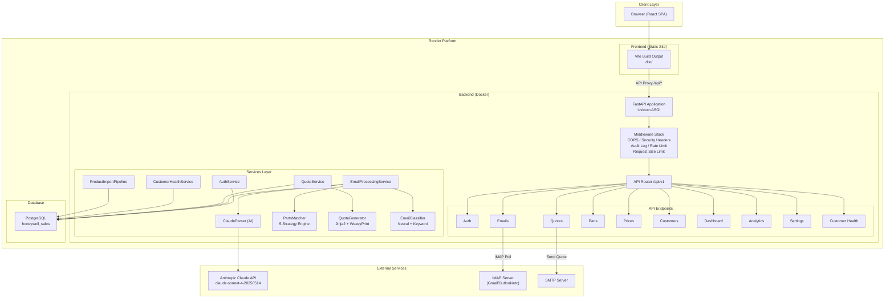
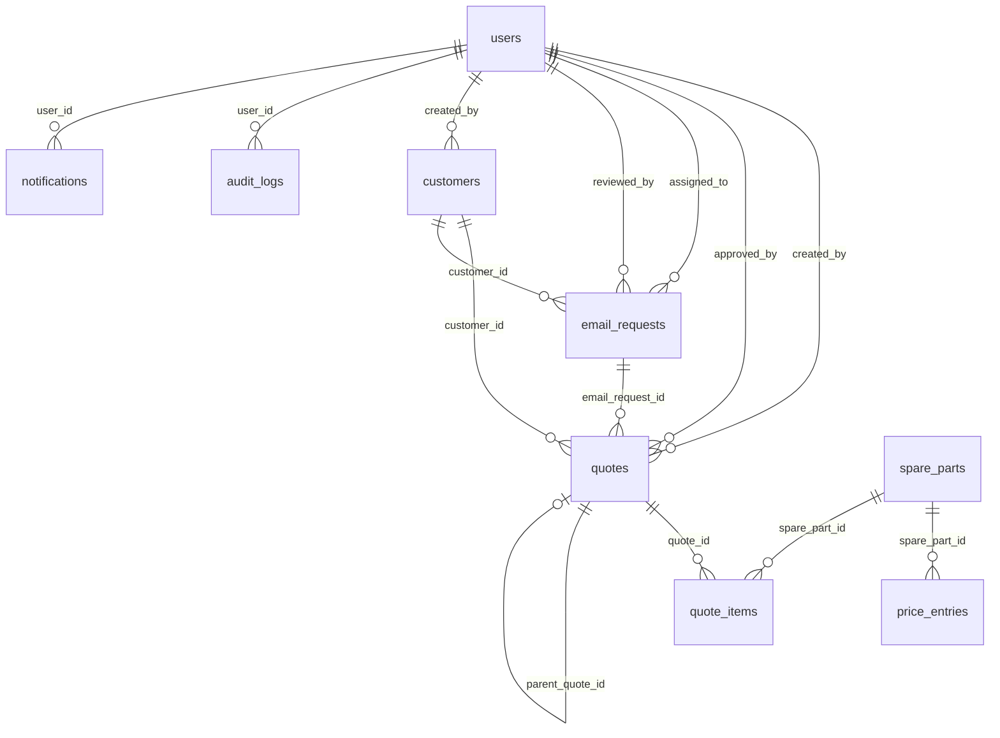
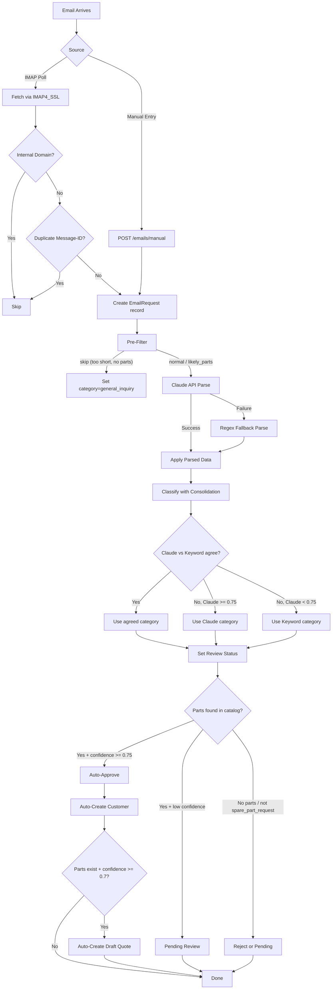
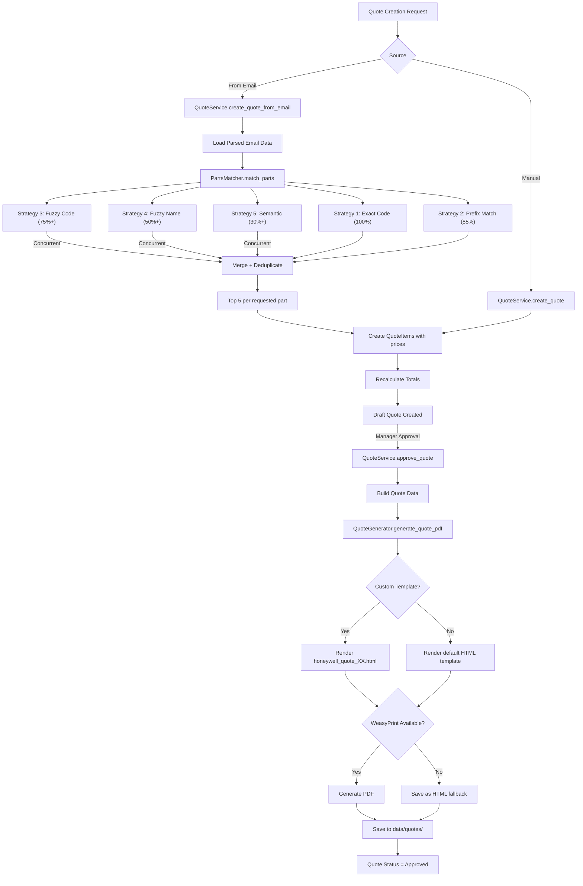

# Honeywell Sales Manager - Technical Documentation

## Table of Contents

1. [Project Overview and Architecture](#1-project-overview-and-architecture)
2. [Tech Stack](#2-tech-stack)
3. [System Architecture Diagram](#3-system-architecture-diagram)
4. [Database Schema](#4-database-schema)
5. [API Reference](#5-api-reference)
6. [Services Layer](#6-services-layer)
7. [Frontend Architecture](#7-frontend-architecture)
8. [Authentication and Authorization](#8-authentication-and-authorization)
9. [Email Processing Pipeline](#9-email-processing-pipeline)
10. [Quote Generation Pipeline](#10-quote-generation-pipeline)
11. [Deployment Architecture](#11-deployment-architecture)
12. [Environment Variables](#12-environment-variables)
13. [Security Features](#13-security-features)

---

## 1. Project Overview and Architecture

Honeywell Sales Manager is a full-stack web application built for the Honeywell Turkey spare-parts sales team. It automates the end-to-end sales workflow: ingesting customer emails requesting spare parts, parsing them with AI (Anthropic Claude), matching requested parts against a product catalog, generating price quotes as PDFs, and sending them to customers.

### Core Capabilities

- **AI-Powered Email Parsing**: Incoming customer emails are parsed by Claude (Anthropic) using a structured tool-use pattern to extract part numbers, quantities, urgency, customer details, and email category.
- **5-Strategy Parts Matching Engine**: Requested parts are matched against the catalog using exact code, prefix, fuzzy code (RapidFuzz), fuzzy name, and semantic search (sentence-transformers).
- **Automated Quote Generation**: Draft quotes are automatically created from parsed emails with matched parts and prices. PDF output is rendered via Jinja2 + WeasyPrint with bilingual (TR/EN) support.
- **Customer Health Scoring**: A weighted scoring system computes a 0-100 health score per customer based on six indicators (quote frequency, response time, value trend, parts diversity, engagement recency, conversion rate).
- **Role-Based Access Control**: Three roles (sales_rep, sales_manager, operations) with granular endpoint-level permissions.
- **Review Workflow**: Emails are auto-classified and routed to pending review, auto-approved, or auto-rejected based on catalog match results and confidence thresholds.

---

## 2. Tech Stack

### Backend

| Component | Technology | Version |
|---|---|---|
| Framework | FastAPI | 0.115.6 |
| ASGI Server | Uvicorn | 0.34.0 |
| Language | Python | 3.11 |
| Database ORM | SQLAlchemy (async) | 2.0.36 |
| DB Driver | asyncpg (PostgreSQL) | 0.30.0 |
| Migrations | Alembic | 1.14.0 |
| Validation | Pydantic | 2.10.3 |
| Settings | pydantic-settings | 2.7.0 |
| AI / LLM | Anthropic (Claude) | 0.40.0 |
| Auth (JWT) | python-jose[cryptography] | 3.3.0 |
| Password Hashing | passlib[bcrypt] + bcrypt | 1.7.4 / 4.0.1 |
| Fuzzy Matching | RapidFuzz | 3.10.1 |
| PDF Generation | WeasyPrint | 63.1 |
| Templating | Jinja2 | 3.1.4 |
| Email (SMTP) | aiosmtplib | 3.0.2 |
| MS Graph | msal + httpx | 1.31.0 / 0.28.1 |
| Rate Limiting | slowapi | 0.1.9 |
| Scheduling | APScheduler | 3.10.4 |
| Data Processing | pandas + openpyxl | 2.2.3 / 3.1.5 |
| Encryption | cryptography (Fernet) | 44.0.0 |

### Frontend

| Component | Technology | Version |
|---|---|---|
| Framework | React | 19.2.4 |
| Language | TypeScript | ~5.9.3 |
| Build Tool | Vite | 8.0.1 |
| Routing | react-router-dom | 7.13.2 |
| State Management | Zustand | 5.0.12 |
| Server State | TanStack React Query | 5.95.2 |
| HTTP Client | Axios | 1.13.6 |
| Forms | react-hook-form + @hookform/resolvers | 7.72.0 / 5.2.2 |
| Validation | Zod | 4.3.6 |
| Charts | Recharts | 3.8.1 |
| Styling | Tailwind CSS | 4.2.2 |
| Icons | Lucide React | 1.7.0 |
| Notifications | Sonner | 2.0.7 |
| Drag and Drop | @dnd-kit/core + @dnd-kit/sortable | 6.3.1 / 10.0.0 |

### Infrastructure

| Component | Technology |
|---|---|
| Database | PostgreSQL (Render managed) |
| Backend Hosting | Render (Docker, web service) |
| Frontend Hosting | Render (static site) |
| Container | Python 3.11-slim (Debian) |

---

## 3. System Architecture Diagram



---

## 4. Database Schema

### 4.1 Entity Relationship Diagram



### 4.2 Table Definitions

#### `users`

| Column | Type | Constraints | Description |
|---|---|---|---|
| `id` | INTEGER | PK, auto-increment | Primary key |
| `email` | VARCHAR(255) | UNIQUE, NOT NULL, INDEX | Login email |
| `full_name` | VARCHAR(255) | NOT NULL | Display name |
| `hashed_password` | VARCHAR(255) | NOT NULL | bcrypt hash |
| `role` | VARCHAR(20) | NOT NULL, default `sales_rep` | `sales_rep`, `sales_manager`, `operations` |
| `is_active` | BOOLEAN | default `true` | Account active flag |
| `email_setup_completed` | BOOLEAN | default `false` | IMAP credentials configured |
| `password_change_required` | BOOLEAN | default `false` | Force password change on login |
| `created_at` | TIMESTAMPTZ | default now() | Creation timestamp |
| `updated_at` | TIMESTAMPTZ | default now(), on-update | Last modification |

#### `customers`

| Column | Type | Constraints | Description |
|---|---|---|---|
| `id` | INTEGER | PK, auto-increment | Primary key |
| `name` | VARCHAR(255) | NOT NULL | Customer name |
| `company` | VARCHAR(255) | nullable | Company name |
| `email` | VARCHAR(255) | UNIQUE, NOT NULL, INDEX | Contact email |
| `phone` | VARCHAR(50) | nullable | Phone number |
| `address` | TEXT | nullable | Address |
| `tax_id` | VARCHAR(50) | nullable | Tax ID |
| `preferred_lang` | VARCHAR(5) | default `tr` | Preferred language for quotes |
| `created_by` | INTEGER | FK -> users.id, nullable | Creator user |
| `created_at` | TIMESTAMPTZ | default now() | Creation timestamp |
| `updated_at` | TIMESTAMPTZ | default now(), on-update | Last modification |

#### `email_requests`

| Column | Type | Constraints | Description |
|---|---|---|---|
| `id` | INTEGER | PK, auto-increment | Primary key |
| `customer_id` | INTEGER | FK -> customers.id, nullable | Linked customer |
| `message_id` | VARCHAR(255) | UNIQUE, NOT NULL, INDEX | Email Message-ID (dedup key) |
| `from_address` | VARCHAR(255) | NOT NULL | Sender address |
| `subject` | VARCHAR(500) | nullable | Email subject |
| `body_text` | TEXT | nullable | Plain text body |
| `body_html` | TEXT | nullable | HTML body |
| `language` | VARCHAR(5) | nullable | Detected language (tr/en/de/fr) |
| `received_at` | TIMESTAMPTZ | nullable | Original receive time |
| `status` | VARCHAR(20) | INDEX, default `new` | `new`, `parsed`, `quoted`, `sent`, `error` |
| `parsed_data` | TEXT | nullable | JSON blob from Claude parsing |
| `error_message` | TEXT | nullable | Error details if status=error |
| `category` | VARCHAR(50) | nullable | `spare_part_request`, `price_inquiry`, `complaint`, `order_status`, `technical_support`, `general_inquiry` |
| `category_confidence` | FLOAT | nullable | 0.0-1.0 classification confidence |
| `price_sensitivity` | BOOLEAN | nullable | Customer appears price-sensitive |
| `sentiment` | VARCHAR(20) | nullable | `positive`, `negative`, `neutral` |
| `sentiment_score` | FLOAT | nullable | Sentiment confidence |
| `is_duplicate` | BOOLEAN | nullable | Duplicate email flag |
| `duplicate_of_id` | INTEGER | nullable | Original email ID if duplicate |
| `is_read` | BOOLEAN | default `false` | Read tracking |
| `last_parsed_at` | TIMESTAMPTZ | nullable | Last Claude parse time (cooldown) |
| `review_status` | VARCHAR(20) | nullable | `pending_review`, `approved`, `rejected` |
| `assigned_to` | INTEGER | FK -> users.id, nullable | Assigned sales rep |
| `reviewed_by` | INTEGER | FK -> users.id, nullable | Reviewing manager |
| `created_at` | TIMESTAMPTZ | default now() | Record creation |

#### `spare_parts`

| Column | Type | Constraints | Description |
|---|---|---|---|
| `id` | INTEGER | PK, auto-increment | Primary key |
| `honeywell_code` | VARCHAR(500) | UNIQUE, NOT NULL, INDEX | Official Honeywell part code |
| `model_number` | VARCHAR(200) | nullable, INDEX | Alternative model number |
| `name_en` | TEXT | nullable | English name |
| `name_tr` | TEXT | nullable | Turkish name |
| `description_en` | TEXT | nullable | English description |
| `description_tr` | TEXT | nullable | Turkish description |
| `category` | VARCHAR(200) | nullable, INDEX | Part category |
| `subcategory` | VARCHAR(200) | nullable | Part subcategory |
| `info` | TEXT | nullable | Additional info |
| `keywords_json` | TEXT | nullable | JSON array of search keywords |
| `aliases_json` | TEXT | nullable | JSON array of code aliases |
| `transfer_price` | FLOAT | nullable | Internal transfer price |
| `supplier_price` | FLOAT | nullable | Supplier cost price |
| `price_currency` | VARCHAR(10) | nullable | Currency for transfer/supplier prices |
| `is_active` | BOOLEAN | default `true` | Active flag (soft delete) |
| `created_at` | TIMESTAMPTZ | default now() | Creation timestamp |

#### `price_entries`

| Column | Type | Constraints | Description |
|---|---|---|---|
| `id` | INTEGER | PK, auto-increment | Primary key |
| `spare_part_id` | INTEGER | FK -> spare_parts.id, NOT NULL, INDEX | Parent part |
| `list_price` | FLOAT | NOT NULL | List/retail price |
| `discount_pct` | FLOAT | default 0.0 | Discount percentage |
| `net_price` | FLOAT | NOT NULL | Net price after discount |
| `currency` | VARCHAR(10) | default `USD` | Price currency |
| `valid_from` | DATE | nullable | Price validity start |
| `valid_until` | DATE | nullable | Price validity end |
| `price_list_version` | VARCHAR(50) | nullable | Price list version identifier |
| `created_at` | TIMESTAMPTZ | default now() | Creation timestamp |

#### `quotes`

| Column | Type | Constraints | Description |
|---|---|---|---|
| `id` | INTEGER | PK, auto-increment | Primary key |
| `quote_number` | VARCHAR(50) | UNIQUE, NOT NULL, INDEX | Format: `QT-YYYYMMDD-XXXXXX` |
| `customer_id` | INTEGER | FK -> customers.id, nullable | Quote recipient |
| `email_request_id` | INTEGER | FK -> email_requests.id, nullable | Source email |
| `created_by` | INTEGER | FK -> users.id, nullable | Creator |
| `approved_by` | INTEGER | FK -> users.id, nullable | Approver |
| `status` | VARCHAR(20) | INDEX, default `draft` | `draft`, `pending_approval`, `approved`, `sent`, `accepted`, `rejected`, `expired` |
| `language` | VARCHAR(5) | default `tr` | Quote language |
| `currency` | VARCHAR(10) | default `TRY` | Quote currency |
| `subtotal` | FLOAT | default 0.0 | Sum of line totals |
| `discount_total` | FLOAT | default 0.0 | Total discount amount |
| `tax_rate` | FLOAT | default 20.0 | Tax rate percentage |
| `tax_amount` | FLOAT | default 0.0 | Calculated tax amount |
| `grand_total` | FLOAT | default 0.0 | Final total (subtotal + tax - discount) |
| `valid_days` | INTEGER | default 30 | Quote validity period |
| `notes` | TEXT | nullable | Free-text notes |
| `pdf_path` | VARCHAR(500) | nullable | Path to generated PDF file |
| `version` | INTEGER | default 1 | Quote revision version |
| `parent_quote_id` | INTEGER | FK -> quotes.id, nullable | Previous version |
| `created_at` | TIMESTAMPTZ | default now() | Creation timestamp |
| `updated_at` | TIMESTAMPTZ | default now(), on-update | Last modification |

#### `quote_items`

| Column | Type | Constraints | Description |
|---|---|---|---|
| `id` | INTEGER | PK, auto-increment | Primary key |
| `quote_id` | INTEGER | FK -> quotes.id (CASCADE), NOT NULL, INDEX | Parent quote |
| `spare_part_id` | INTEGER | FK -> spare_parts.id, nullable | Matched catalog part |
| `original_text` | TEXT | nullable | Original text from customer email |
| `honeywell_code` | VARCHAR(100) | nullable | Part code (from match or manual) |
| `description` | VARCHAR(500) | nullable | Line item description |
| `quantity` | INTEGER | default 1 | Requested quantity |
| `unit_price` | FLOAT | default 0.0 | Price per unit |
| `discount_pct` | FLOAT | default 0.0 | Line item discount |
| `line_total` | FLOAT | default 0.0 | quantity * unit_price * (1 - discount_pct/100) |
| `match_score` | FLOAT | nullable | Part matching confidence (0-100) |
| `match_strategy` | VARCHAR(50) | nullable | `exact_code`, `prefix_code`, `fuzzy_code`, `fuzzy_name`, `semantic` |
| `is_confirmed` | BOOLEAN | default `false` | User confirmed the match |
| `sort_order` | INTEGER | default 0 | Display order |

#### `audit_logs`

| Column | Type | Constraints | Description |
|---|---|---|---|
| `id` | INTEGER | PK, auto-increment | Primary key |
| `user_id` | INTEGER | FK -> users.id, nullable | Actor |
| `action` | VARCHAR(50) | NOT NULL | Action type |
| `entity_type` | VARCHAR(50) | NOT NULL, INDEX | Affected entity type |
| `entity_id` | INTEGER | NOT NULL | Affected entity ID |
| `changes` | TEXT | nullable | JSON diff of changes |
| `ip_address` | VARCHAR(50) | nullable | Client IP |
| `created_at` | TIMESTAMPTZ | default now() | Timestamp |

#### `notifications`

| Column | Type | Constraints | Description |
|---|---|---|---|
| `id` | INTEGER | PK, auto-increment | Primary key |
| `user_id` | INTEGER | FK -> users.id, NOT NULL, INDEX | Recipient |
| `type` | VARCHAR(50) | NOT NULL | Notification type |
| `title` | VARCHAR(255) | NOT NULL | Title |
| `message` | TEXT | nullable | Body |
| `is_read` | BOOLEAN | default `false` | Read flag |
| `entity_type` | VARCHAR(50) | nullable | Related entity type |
| `entity_id` | INTEGER | nullable | Related entity ID |
| `created_at` | TIMESTAMPTZ | default now() | Timestamp |

#### `settings`

| Column | Type | Constraints | Description |
|---|---|---|---|
| `id` | INTEGER | PK, auto-increment | Primary key |
| `key` | VARCHAR(100) | UNIQUE, NOT NULL, INDEX | Setting key |
| `value` | TEXT | nullable | Setting value |
| `updated_at` | TIMESTAMPTZ | default now(), on-update | Last modification |

### 4.3 Enumerations

**QuoteStatus**: `draft` -> `pending_approval` -> `approved` -> `sent` -> `accepted` | `rejected` | `expired`

**EmailStatus**: `new` -> `parsed` -> `quoted` -> `sent` | `error`

**ReviewStatus**: `pending_review` -> `approved` | `rejected`

**UserRole**: `sales_rep`, `sales_manager`, `operations`

---

## 5. API Reference

Base URL: `/api/v1`

All endpoints except `/auth/login` require a valid JWT Bearer token in the `Authorization` header.

### 5.1 Health Check

#### `GET /api/health`
- **Auth**: None
- **Description**: Load balancer health check.
- **Response**: `200 OK`
  ```json
  { "status": "healthy", "service": "honeywell-sales-manager" }
  ```

---

### 5.2 Auth Endpoints (`/auth`)

#### `POST /auth/login`
- **Auth**: None (rate limited: 5/minute)
- **Description**: OAuth2-compatible login. Returns access + refresh tokens.
- **Request**: `application/x-www-form-urlencoded`
  | Field | Type | Required |
  |---|---|---|
  | `username` | string (email) | Yes |
  | `password` | string | Yes |
- **Response**: `200 OK`
  ```json
  {
    "access_token": "eyJ...",
    "refresh_token": "eyJ...",
    "token_type": "bearer",
    "password_change_required": false,
    "user": { "id": 1, "email": "...", "full_name": "...", "role": "...", "is_active": true, "email_setup_completed": false, "password_change_required": false, "created_at": "..." }
  }
  ```
- **Errors**: `401` Invalid credentials

#### `POST /auth/register`
- **Auth**: `sales_manager` role required
- **Description**: Register a new user.
- **Request Body**:
  | Field | Type | Required | Constraints |
  |---|---|---|---|
  | `email` | EmailStr | Yes | Valid email |
  | `full_name` | string | Yes | 1-255 chars |
  | `password` | string | Yes | 6-128 chars, strength validated |
  | `role` | string | No | `sales_rep` (default), `sales_manager`, `operations` |
- **Response**: `200 OK` - UserResponse
- **Errors**: `400` duplicate email, weak password; `403` insufficient role

#### `GET /auth/me`
- **Auth**: Any authenticated user
- **Description**: Return current user info.
- **Response**: `200 OK` - UserResponse

#### `POST /auth/refresh`
- **Auth**: None (valid refresh token required)
- **Request Body**: `{ "refresh_token": "..." }`
- **Description**: Exchange refresh token for new token pair. Old refresh token is revoked (rotation).
- **Response**: `200 OK` - TokenResponse
- **Errors**: `401` invalid/expired refresh token

#### `POST /auth/logout`
- **Auth**: Any authenticated user
- **Request Body**: `{ "refresh_token": "..." }` (optional)
- **Description**: Revoke refresh token.
- **Response**: `200 OK` - `{ "message": "Logged out successfully" }`

#### `POST /auth/change-password`
- **Auth**: Any authenticated user
- **Request Body**:
  | Field | Type | Required | Constraints |
  |---|---|---|---|
  | `current_password` | string | Yes | min 1 char |
  | `new_password` | string | Yes | 8-128 chars, strength validated |
- **Response**: `200 OK` - `{ "message": "Password changed successfully" }`
- **Errors**: `400` incorrect current password, weak new password

---

### 5.3 Email Endpoints (`/emails`)

#### `GET /emails/`
- **Auth**: `sales_rep` or `sales_manager`
- **Description**: List emails with pagination, filtering, and search.
- **Query Parameters**:
  | Param | Type | Default | Description |
  |---|---|---|---|
  | `page` | int | 1 | Page number (1-10000) |
  | `page_size` | int | 20 | Items per page (1-100) |
  | `is_read` | bool | null | Filter by read status |
  | `status` | string | null | Filter by processing status |
  | `review_status` | string | null | Filter by review status |
  | `category` | string | null | Filter by category |
  | `search` | string | null | Search in subject/from_address |
- **Response**: `200 OK` - PaginatedResponse of email objects

#### `GET /emails/{email_id}`
- **Auth**: `sales_rep` or `sales_manager`
- **Description**: Get email detail including body and parsed data.
- **Response**: `200 OK` - Email object with body_text, body_html, parsed_data
- **Errors**: `404` email not found

#### `POST /emails/manual`
- **Auth**: `sales_rep` or `sales_manager`
- **Description**: Create a manual email entry and trigger AI parsing.
- **Request Body**:
  | Field | Type | Required | Constraints |
  |---|---|---|---|
  | `from_address` | EmailStr | Yes | Valid email |
  | `subject` | string | Yes | 1-500 chars |
  | `body_text` | string | Yes | 1-50000 chars |
- **Response**: `201 Created` - Email object

#### `POST /emails/poll`
- **Auth**: `sales_rep` or `sales_manager`
- **Description**: Fetch new emails via IMAP using stored credentials. Skips internal domains and duplicates. Triggers AI parsing for each new email.
- **Response**: `200 OK`
  ```json
  { "message": "3 yeni email alindi", "fetched_count": 3 }
  ```
- **Errors**: `400` credentials not configured

#### `PATCH /emails/{email_id}/read`
- **Auth**: Any authenticated user
- **Description**: Mark an email as read.
- **Response**: `200 OK` - `{ "message": "OK" }`

#### `POST /emails/{email_id}/reparse`
- **Auth**: `sales_rep` or `sales_manager`
- **Description**: Re-parse an email with Claude. 15-minute cooldown between parses to control API costs.
- **Response**: `200 OK` - `{ "message": "Email X ayristirildi", "status": "parsed" }`
- **Errors**: `400` cooldown active; `404` email not found

#### `GET /emails/{email_id}/matches`
- **Auth**: `sales_rep` or `sales_manager`
- **Description**: Get part match results for a parsed email.
- **Response**: `200 OK`
  ```json
  { "email_id": 1, "status": "parsed", "parsed_data": {...}, "matches": [] }
  ```

#### `PATCH /emails/{email_id}/review`
- **Auth**: `sales_manager` only
- **Description**: Approve or reject an email. On approval, auto-creates customer and draft quote.
- **Request Body**: `{ "action": "approve" | "reject" }`
- **Response**: `200 OK` - Email object
- **Errors**: `400` email not in pending_review status; `404` not found

---

### 5.4 Quote Endpoints (`/quotes`)

#### `GET /quotes/`
- **Auth**: Any authenticated user
- **Query Parameters**: `page`, `page_size`, `status`, `customer_id`
- **Response**: `200 OK` - PaginatedResponse of quotes with items

#### `GET /quotes/{quote_id}`
- **Auth**: Any authenticated user
- **Response**: `200 OK` - Quote with items and customer info
- **Errors**: `404` not found

#### `POST /quotes/`
- **Auth**: `sales_rep` or `sales_manager`
- **Description**: Create a quote manually.
- **Request Body**:
  | Field | Type | Required | Default |
  |---|---|---|---|
  | `customer_id` | int | No | null |
  | `language` | string | No | `tr` |
  | `currency` | string | No | `TRY` |
  | `tax_rate` | float | No | 20.0 |
  | `notes` | string | No | null |
  | `items` | QuoteItemCreate[] | No | [] |

  **QuoteItemCreate**:
  | Field | Type | Required |
  |---|---|---|
  | `spare_part_id` | int | No |
  | `honeywell_code` | string | No |
  | `description` | string | No |
  | `quantity` | int | Yes (>=1) |
  | `unit_price` | float | Yes (>=0) |
  | `discount_pct` | float | No (0-100) |
- **Response**: `201 Created` - Quote with items

#### `POST /quotes/from-email/{email_id}`
- **Auth**: `sales_rep` or `sales_manager`
- **Description**: Create a quote from a parsed email. Runs 5-strategy parts matching and auto-populates items with prices.
- **Response**: `201 Created` - Quote with matched items
- **Errors**: `400` email not parsed yet; `404` email not found

#### `PUT /quotes/{quote_id}`
- **Auth**: `sales_rep` or `sales_manager`
- **Description**: Update quote header and/or replace items. Only editable in `draft` or `pending_approval` status.
- **Request Body**: QuoteUpdate (all fields optional, items array replaces existing)
- **Response**: `200 OK` - Updated quote
- **Errors**: `400` wrong status for editing

#### `PATCH /quotes/{quote_id}/approve`
- **Auth**: `sales_manager` only
- **Description**: Approve a quote, generate PDF, set status to approved.
- **Response**: `200 OK` - Approved quote with `has_pdf: true`
- **Errors**: `400` wrong status for approval, PDF generation failure

#### `POST /quotes/{quote_id}/send`
- **Auth**: `sales_rep` or `sales_manager`
- **Description**: Mark quote as sent. (Email sending is currently a placeholder.)
- **Response**: `200 OK`
- **Errors**: `400` quote must be approved first

#### `GET /quotes/{quote_id}/pdf`
- **Auth**: Creator or `sales_manager`
- **Description**: Download quote PDF. Regenerates on-the-fly if file is missing (ephemeral filesystem).
- **Response**: `200 OK` - `application/pdf` file
- **Errors**: `403` not authorized to download; `400` PDF generation failed; `404` not found

---

### 5.5 Spare Parts Endpoints (`/parts`)

#### `GET /parts/`
- **Auth**: Any authenticated user
- **Query Parameters**: `page`, `page_size`, `search` (code/name), `category`
- **Response**: `200 OK` - PaginatedResponse of parts (active only)

#### `GET /parts/categories`
- **Auth**: Any authenticated user
- **Response**: `200 OK` - `["category1", "category2", ...]`

#### `GET /parts/{part_id}`
- **Auth**: Any authenticated user
- **Response**: `200 OK` - Part with nested `prices` array
- **Errors**: `404` not found

#### `POST /parts/`
- **Auth**: `operations` role only
- **Description**: Create a new spare part.
- **Request Body** (dict):
  | Field | Type | Required |
  |---|---|---|
  | `honeywell_code` | string | Yes |
  | `name_en`, `name_tr` | string | No |
  | `description_en`, `description_tr` | string | No |
  | `category`, `subcategory` | string | No |
  | `keywords_json`, `aliases_json` | string | No |
- **Response**: `201 Created`
- **Errors**: `400` duplicate code

#### `PUT /parts/{part_id}`
- **Auth**: `operations` role only
- **Description**: Update a spare part.
- **Updatable fields**: `honeywell_code`, `model_number`, `info`, `name_en`, `name_tr`, `description_en`, `description_tr`, `category`, `subcategory`, `transfer_price`, `supplier_price`, `keywords_json`, `aliases_json`
- **Response**: `200 OK`

#### `DELETE /parts/{part_id}`
- **Auth**: `operations` role only
- **Description**: Soft delete (sets `is_active=false`).
- **Response**: `200 OK`

#### `POST /parts/import`
- **Auth**: `operations` or `sales_manager`
- **Description**: Import parts and prices from Excel/CSV/JSON. Uses intelligent field mapping with Turkish character normalization.
- **Request**: `multipart/form-data` with `file` field
- **Allowed extensions**: `.csv`, `.xlsx`, `.xls`, `.json`
- **Max size**: 10 MB
- **Response**: `201 Created` - Import results with counts

---

### 5.6 Price Endpoints (`/prices`)

#### `GET /prices/`
- **Auth**: Any authenticated user
- **Query Parameters**: `page`, `page_size`, `spare_part_id`, `currency`
- **Response**: `200 OK` - PaginatedResponse of price entries with spare_part info

#### `POST /prices/`
- **Auth**: `operations` role only
- **Request Body**:
  | Field | Type | Required |
  |---|---|---|
  | `spare_part_id` | int | Yes |
  | `list_price` | float | Yes |
  | `net_price` | float | Yes |
  | `discount_pct` | float | No (default 0) |
  | `currency` | string | No (default `USD`) |
  | `valid_from`, `valid_until` | date string | No |
  | `price_list_version` | string | No |
- **Response**: `201 Created`

#### `POST /prices/import`
- **Auth**: `operations` role only
- **Description**: Import price entries from Excel/CSV. Looks up spare parts by `honeywell_code`.
- **Response**: `201 Created` - Import results

---

### 5.7 Customer Endpoints (`/customers`)

#### `GET /customers/`
- **Auth**: Any authenticated user
- **Query Parameters**: `page`, `page_size`, `search` (name/company/email)
- **Response**: `200 OK` - PaginatedResponse with `quote_count` and `total_quote_value` per customer

#### `GET /customers/{customer_id}`
- **Auth**: Any authenticated user
- **Response**: `200 OK` - Customer with `stats` object (total_quotes, total_value, sent_quotes)

#### `POST /customers/`
- **Auth**: `sales_rep` or `sales_manager`
- **Request Body**: `{ "name": "...", "email": "...", "company": "...", "phone": "...", "address": "...", "tax_id": "...", "preferred_lang": "tr" }`
- **Required**: `name`, `email`
- **Response**: `201 Created`
- **Errors**: `400` duplicate email

#### `PUT /customers/{customer_id}`
- **Auth**: `sales_rep` or `sales_manager`
- **Updatable fields**: `name`, `company`, `email`, `phone`, `address`, `tax_id`, `preferred_lang`
- **Response**: `200 OK`

#### `POST /customers/import`
- **Auth**: `sales_rep` or `sales_manager`
- **Description**: Import customers from Excel/CSV. Required columns: `name`, `email`.
- **Response**: `201 Created` - Import results

---

### 5.8 Customer Health Endpoints (`/customers/health`)

#### `GET /customers/health/overview`
- **Auth**: Any authenticated user
- **Description**: Health score summary for all customers.
- **Response**: `200 OK`
  ```json
  {
    "summary": { "total_customers": 50, "healthy_count": 30, "at_risk_count": 15, "churning_count": 5, "average_score": 65.3 },
    "customers": [ { "customer_id": 1, "customer_name": "...", "company": "...", "score": 85, "risk_level": "healthy", "indicators": [...], "recommendations": [...] } ]
  }
  ```

#### `GET /customers/health/at-risk`
- **Auth**: Any authenticated user
- **Query Parameters**: `limit` (1-50, default 10)
- **Response**: `200 OK` - List of at-risk and churning customers sorted by score ascending

#### `GET /customers/health/{customer_id}`
- **Auth**: Any authenticated user
- **Response**: `200 OK` - Full health report with six indicators and recommendations
- **Errors**: `404` customer not found

---

### 5.9 Dashboard Endpoints (`/dashboard`)

#### `GET /dashboard/stats`
- **Auth**: Any authenticated user
- **Description**: Dashboard KPIs including doughnut chart ratios.
- **Response**: `200 OK`
  ```json
  {
    "total_emails": 150,
    "parsed_emails": 140,
    "total_quotes": 80,
    "sent_quotes": 45,
    "total_parts": 500,
    "total_customers": 60,
    "conversion_rate": 56.25,
    "avg_response_hours": 0.0,
    "pending_review_count": 5,
    "pending_value": 125000.00,
    "answered_emails": 45,
    "total_parts_value": 500000.00,
    "answered_parts_value": 280000.00,
    "total_parts_count": 300,
    "answered_parts_count": 170,
    "approved_quotes": 50
  }
  ```

---

### 5.10 Analytics Endpoints (`/analytics`)

#### `GET /analytics/top-parts`
- **Auth**: `sales_manager` only
- **Query Parameters**: `days` (1-365, default 30), `limit` (1-100, default 10)
- **Response**: `200 OK` - Array of top requested parts with counts and values

#### `GET /analytics/monthly-trend`
- **Auth**: `sales_manager` only
- **Query Parameters**: `months` (1-36, default 12)
- **Response**: `200 OK` - Array of monthly data points with quote_count, revenue, sent_count

#### `GET /analytics/category-breakdown`
- **Auth**: `sales_manager` only
- **Query Parameters**: `days` (1-365, default 30)
- **Response**: `200 OK` - Array of categories with item_count, total_quantity, total_value

#### `GET /analytics/parts-without-price`
- **Auth**: `sales_manager` only
- **Description**: Parts requested in quotes but missing price entries.
- **Response**: `200 OK` - Array with status `no_price` or `unknown_part`

---

### 5.11 Settings Endpoints (`/settings`)

#### `GET /settings/`
- **Auth**: `sales_manager` only
- **Description**: Get all settings as key-value map. Password fields are masked.
- **Response**: `200 OK` - `{ "settings": { "key": "value", ... } }`

#### `PUT /settings/`
- **Auth**: `sales_manager` only
- **Request Body**:
  | Field | Type | Required |
  |---|---|---|
  | `quote_prefix` | string | No |
  | `default_tax_rate` | float | No |
  | `default_currency` | string | No |
  | `quote_validity_days` | int | No |
- **Response**: `200 OK` - Updated settings

#### `POST /settings/email-credentials`
- **Auth**: Any authenticated user
- **Description**: Save IMAP/SMTP email credentials. Passwords are encrypted with Fernet. Auto-detects provider settings from email domain.
- **Request Body**:
  | Field | Type | Required | Default |
  |---|---|---|---|
  | `email_address` | string | Yes | - |
  | `email_password` | string | Yes | - |
  | `imap_host` | string | No | auto-detected |
  | `imap_port` | int | No | 993 |
  | `smtp_host` | string | No | auto-detected |
  | `smtp_port` | int | No | 587 |
- **Supported providers (auto-detect)**: Gmail, Yahoo, Outlook/Hotmail/Live, Yandex, iCloud
- **Response**: `200 OK`

#### `GET /settings/email-credentials`
- **Auth**: Any authenticated user
- **Description**: Get email credentials (password masked as `********`).
- **Response**: `200 OK` - Credentials with `is_configured` flag

#### `POST /settings/email-credentials/test`
- **Auth**: Any authenticated user
- **Description**: Test IMAP connection. Accepts direct credentials or uses stored ones.
- **Response**: `200 OK`
  ```json
  { "success": true, "message": "Baglanti basarili! (imap.gmail.com) Gelen kutusunda 150 email bulundu." }
  ```

---

## 6. Services Layer

### 6.1 EmailProcessingService
**File**: `backend/app/services/email_processing_service.py`

Orchestrates the full email parsing pipeline.

| Method | Description |
|---|---|
| `process_email(email_id)` | Full pipeline: pre-filter -> Claude parse (with regex fallback) -> classify -> set review status -> auto-create customer/quote if approved |
| `create_manual_email(from_address, subject, body_text, assigned_to)` | Creates email record and triggers the same parsing pipeline |

**Internal pipeline steps**:
1. `_parse_email_with_fallback()` - Pre-filters short emails, calls Claude API, falls back to regex parser on failure
2. `_apply_parsed_data()` - Writes parsed JSON and language to the email record
3. `_classify_with_consolidation()` - Merges Claude category with keyword classifier; uses Claude if confident (>=0.75), keyword otherwise
4. `_set_review_status()` - Auto-approves if parts match catalog AND confidence >= 0.75; pending_review if parts exist but low confidence or no catalog match; rejected if not a parts request
5. `_auto_create_customer()` - Creates or links customer from email address
6. `_auto_create_draft_quote()` - Creates draft quote with matched items if confidence >= 0.7

### 6.2 QuoteService
**File**: `backend/app/services/quote_service.py`

| Method | Description |
|---|---|
| `create_quote(customer_id, items, ...)` | Create a new quote with line items, auto-calculates totals |
| `create_quote_from_email(email_id, created_by)` | Create quote from parsed email data with 5-strategy parts matching |
| `update_quote(quote_id, data, items)` | Update header fields and optionally replace all items |
| `approve_quote(quote_id, approved_by)` | Approve, generate PDF, update status |
| `generate_quote_number()` | Generates `QT-YYYYMMDD-XXXXXX` format |

Auto-confirm threshold: parts with match score >= 80 are auto-confirmed.

### 6.3 ClaudeParser (AI)
**File**: `backend/app/services/claude_parser.py`

- Uses Anthropic Claude `claude-sonnet-4-20250514` with structured **tool-use** pattern
- Defines `extract_email_data` tool schema for reliable JSON extraction
- SHA256-based LRU cache (max 5000 entries) to avoid duplicate API calls
- Retry with exponential backoff (3 attempts, 1s/2s/4s delays)
- Bilingual system prompt (Turkish/English) with Honeywell-specific part code patterns
- Extracts: language, customer_name, customer_company, parts (code, description, quantity, urgency), is_spare_part_request, category, confidence

### 6.4 PartsMatcher (5-Strategy Engine)
**File**: `backend/app/services/parts_matcher.py`

Cascading match strategies with concurrent execution:

| Strategy | Score | Method |
|---|---|---|
| 1. Exact code match | 100% | Normalized code comparison |
| 2. Prefix match | 85% | >=4 char prefix on code |
| 3. Fuzzy code match | 75%+ | RapidFuzz token_sort_ratio on honeywell_code and model_number |
| 4. Fuzzy name match | 50%+ | RapidFuzz on name_tr/name_en |
| 5. Semantic search | 30%+ | sentence-transformers embeddings (optional) |

Strategies 3-5 run concurrently via `asyncio.to_thread`. Results are deduplicated by spare_part_id, sorted by score, top 5 returned. Catalog is cached for 5 minutes.

### 6.5 QuoteGenerator (PDF)
**File**: `backend/app/services/quote_generator.py`

- Generates bilingual (TR/EN) PDF quotes using Jinja2 templates + WeasyPrint
- Supports custom Honeywell-branded templates (`honeywell_quote_tr.html`, `honeywell_quote_en.html`)
- Falls back to built-in HTML template if custom templates are missing
- Falls back to HTML output if WeasyPrint is unavailable
- Bilingual date formatting: "March 30, 2026 - 30 Mart 2026"
- Honeywell brand colors: `#c8102e` (red)

### 6.6 EmailClassifier
**File**: `backend/app/services/email_classifier.py`

Dual-mode classification:

1. **Neural (primary)**: HuggingFace zero-shot classifier (`MoritzLaurer/mDeBERTa-v3-base-xnli-multilingual-nli-2mil7`) with multilingual NLI
2. **Keyword (fallback)**: Pattern matching with weighted category keywords in TR/EN
3. **Sentiment analysis**: Turkish BERT model (`savasy/bert-base-turkish-sentiment-cased`)
4. **Price sensitivity detection**: Keyword scanning for budget/discount/competitor terms

Categories: `spare_part_request`, `price_inquiry`, `complaint`, `order_status`, `technical_support`, `general_inquiry`

### 6.7 CustomerHealthService
**File**: `backend/app/services/customer_health_service.py`

Computes a 0-100 weighted health score per customer based on six indicators:

| Indicator | Description |
|---|---|
| Quote Frequency | Number of quotes in last 180 days |
| Response Time | Average time from email to quote creation |
| Quote Value Trend | Comparison of recent (90d) vs older (180d) quote values |
| Parts Diversity | Number of distinct part categories requested |
| Engagement Recency | Days since last interaction |
| Conversion Rate | Ratio of sent/accepted quotes to total |

Risk levels: `healthy` (>=70), `at_risk` (>=40), `churning` (<40)

Generates actionable Turkish-language recommendations based on low-scoring indicators.

### 6.8 AuthService
**File**: `backend/app/services/auth_service.py`

| Method | Description |
|---|---|
| `authenticate(db, email, password)` | Verify credentials, return User or None |
| `register(db, email, password, full_name, role)` | Create user with password strength validation |
| `create_default_admin(db)` | Creates/syncs admin user from env vars on startup |

### 6.9 ProductImportPipeline
**File**: `backend/app/services/product_import_pipeline.py`

Intelligent Excel/CSV/JSON importer with:
- Turkish character normalization (e.g., "aciklama" matches "aciklama")
- Flexible header detection (scans for known keywords to find the real header row)
- Field mapping: maps various column names to model fields (e.g., "Model Number", "Model No", "Urun Kodu" all map to `model_number`)
- Handles both part info and price info from a single file

### 6.10 RegexFallbackParser
**File**: `backend/app/services/regex_fallback_parser.py`

Fallback parser for when Claude API is unavailable:
- Honeywell part code regex patterns (7 patterns covering formats like `C7061A1012`, `51309276-150`, etc.)
- False positive filtering (ISO, HTTP, IBAN, etc.)
- Quantity extraction patterns (Turkish "adet", English "pcs"/"qty")
- Customer name extraction from email signatures
- Pre-filter function to skip API calls for short emails without part codes

---

## 7. Frontend Architecture

### 7.1 Routing Structure

| Path | Component | Description |
|---|---|---|
| `/login` | LoginPage | Public login form |
| `/` | DashboardPage | KPI dashboard with charts |
| `/emails` | EmailListPage | Paginated email inbox |
| `/emails/:id` | EmailDetailPage | Email detail with parsed data |
| `/parts` | PartsPage | Spare parts catalog management |
| `/quotes` | QuoteListPage | Quote listing |
| `/quotes/new` | QuoteEditorPage | Create new quote |
| `/quotes/:id` | QuoteEditorPage | Edit existing quote |
| `/customers` | CustomerListPage | Customer management |
| `/customers/:id` | CustomerDetailPage | Customer detail with health score |
| `/settings` | SettingsPage | Application settings and email config |
| `*` | Redirect to `/` | Catch-all |

All routes except `/login` are wrapped in `AuthGuard`. All page components use `React.lazy()` with `Suspense` for code splitting.

### 7.2 State Management

**Zustand stores**:

- **`authStore`**: Authentication state (user, tokens, login/logout actions). Tokens stored in `localStorage`. Error messages extracted from API responses with Turkish translations.
- **`preferencesStore`**: UI preferences persisted to `localStorage` under key `honeywell-preferences`. Supports theme (`light`/`dark`), language (`tr`/`en`/`de`/`fr`/`es`), and font size offset (-4 to +4).

**TanStack React Query**: Used for server state management (data fetching, caching, invalidation).

### 7.3 API Client

Axios instance with:
- Automatic JWT attachment via request interceptor
- Automatic token refresh with queue-based retry on 401 responses (refresh token rotation)
- Automatic redirect to `/login` on auth failure
- Turkish error messages via toast notifications (Sonner)
- Structured error handling for 401, 403, 422, 500 status codes

### 7.4 Theming and Styling

- **Tailwind CSS 4.2** with custom theme tokens
- Custom colors: `honeywell-red` (#D32F2F), `honeywell-dark` (#B71C1C), `honeywell-light` (#FFCDD2)
- Fonts: `Exo 2` (sans), `Roboto Mono` (mono)
- Full dark mode support via `.dark` class on `<html>`
- `prefers-reduced-motion` media query support
- Global CSS transitions with opt-in duration

---

## 8. Authentication and Authorization

### 8.1 Authentication Flow

```
1. User submits email + password via OAuth2-compatible form
2. Backend verifies credentials (bcrypt hash comparison)
3. Server issues JWT access token (30 min) + refresh token (7 days)
   - Both contain: sub (user_id), exp, type (access/refresh), jti (unique ID)
4. Frontend stores tokens in localStorage
5. All API requests attach access token as Bearer header
6. On 401, frontend queues failed requests, refreshes token, replays queue
7. Refresh token rotation: old refresh token revoked on each refresh
8. On logout, refresh token is explicitly revoked server-side
```

### 8.2 Password Policy

- Minimum 8 characters
- At least 1 uppercase letter, 1 lowercase letter, 1 digit
- Validated on registration and password change
- Default admin has `password_change_required: true`

### 8.3 Role Permissions Matrix

| Endpoint | sales_rep | sales_manager | operations |
|---|---|---|---|
| Auth (login/me/change-password) | Yes | Yes | Yes |
| Register new users | No | Yes | No |
| List/view emails | Yes | Yes | No |
| Create manual email | Yes | Yes | No |
| Poll emails | Yes | Yes | No |
| Approve/reject emails | No | Yes | No |
| List/view quotes | Yes | Yes | Yes |
| Create quotes | Yes | Yes | No |
| Update quotes | Yes | Yes | No |
| Approve quotes | No | Yes | No |
| Download quote PDF | Creator only | Yes | No |
| List/view parts | Yes | Yes | Yes |
| Create/update/delete parts | No | No | Yes |
| Import parts | No | Yes | Yes |
| Create prices | No | No | Yes |
| Import prices | No | No | Yes |
| List/view customers | Yes | Yes | Yes |
| Create/update customers | Yes | Yes | No |
| Analytics | No | Yes | No |
| Settings | No | Yes | No |
| Customer Health | Yes | Yes | Yes |

---

## 9. Email Processing Pipeline



---

## 10. Quote Generation Pipeline



---

## 11. Deployment Architecture

### Render Blueprint (`render.yaml`)

```
Services:
  1. honeywell-backend (Docker web service)
     - Runtime: Docker (Python 3.11-slim)
     - Health check: GET /api/health
     - Port: 8000
     - Non-root user (appuser, UID 1000)

  2. honeywell-frontend (Static site)
     - Build: npm ci && npm run build
     - Publish: dist/
     - Rewrites: /api/* -> backend URL
     - Security headers: X-Content-Type-Options: nosniff

Database:
  - honeywell-db (PostgreSQL, managed by Render)
  - Database name: honeywell_sales
```

### Docker Container Details

- Base: `python:3.11-slim`
- System deps: WeasyPrint dependencies (pango, cairo, gdk-pixbuf, libffi)
- Data directories: `data/quotes`, `data/uploads`, `data/models`, `data/cache`
- Runs as non-root user `appuser`
- Startup: `uvicorn app.main:app --host 0.0.0.0 --port ${PORT:-8000}`

### Startup Lifecycle

1. Create database tables via `Base.metadata.create_all`
2. Run auto-migrations (add missing columns safely with `IF NOT EXISTS`)
3. Create data directories (`data/quotes`, `data/uploads`)
4. Create default admin user from env vars
5. Start APScheduler
6. Application ready

---

## 12. Environment Variables

| Variable | Required | Default | Description |
|---|---|---|---|
| `ENV` | No | `development` | `development`, `staging`, `production` |
| `DATABASE_URL` | Prod: Yes | `""` | PostgreSQL connection string |
| `JWT_SECRET_KEY` | Prod: Yes | random per-start | JWT signing key (>=32 chars in prod) |
| `JWT_ALGORITHM` | No | `HS256` | JWT algorithm |
| `ACCESS_TOKEN_EXPIRE_MINUTES` | No | `30` | Access token lifetime |
| `REFRESH_TOKEN_EXPIRE_DAYS` | No | `7` | Refresh token lifetime |
| `DEFAULT_ADMIN_EMAIL` | No | `admin@honeywell.com` | Default admin email |
| `DEFAULT_ADMIN_PASSWORD` | No | `""` | Default admin password |
| `CORS_ORIGINS` | No | `http://localhost,...:5173` | Comma-separated allowed origins |
| `AZURE_TENANT_ID` | No | `""` | MS Graph tenant ID |
| `AZURE_CLIENT_ID` | No | `""` | MS Graph client ID |
| `AZURE_CLIENT_SECRET` | No | `""` | MS Graph client secret |
| `GRAPH_USER_EMAIL` | No | `""` | MS Graph mailbox email |
| `GRAPH_WEBHOOK_SECRET` | No | `""` | MS Graph webhook secret |
| `INTERNAL_EMAIL_DOMAINS` | No | `honeywell.com,honeywell.com.tr` | Domains to skip parsing |
| `SMTP_HOST` | No | `smtp.office365.com` | SMTP server |
| `SMTP_PORT` | No | `587` | SMTP port |
| `SMTP_USER` | No | `""` | SMTP username |
| `SMTP_PASSWORD` | No | `""` | SMTP password |
| `SMTP_FROM_ADDRESS` | No | `""` | SMTP from address |
| `ANTHROPIC_API_KEY` | No | `""` | Claude API key |
| `COMPANY_NAME` | No | `Honeywell Turkey` | Company name for PDF quotes |
| `COMPANY_ADDRESS` | No | `Istanbul, Turkey` | Company address |
| `COMPANY_PHONE` | No | `+90 212 000 0000` | Company phone |
| `COMPANY_TAX_ID` | No | `""` | Company tax ID |
| `QUOTE_PREFIX` | No | `HW-2026-` | Quote number prefix |
| `DEFAULT_TAX_RATE` | No | `20.0` | Default tax rate (%) |
| `DEFAULT_CURRENCY` | No | `TRY` | Default currency |
| `QUOTE_VALIDITY_DAYS` | No | `30` | Default quote validity |
| `QUOTES_DIR` | No | `data/quotes` | PDF output directory |
| `UPLOADS_DIR` | No | `data/uploads` | Upload directory |
| `TEMPLATES_DIR` | No | `app/templates` | Jinja2 templates directory |
| `EMAIL_POLL_INTERVAL_MINUTES` | No | `5` | Email polling interval |
| `RATE_LIMIT_LOGIN` | No | `5/minute` | Login rate limit |
| `RATE_LIMIT_API` | No | `100/minute` | General API rate limit |
| `ALLOWED_UPLOAD_EXTENSIONS` | No | `.csv,.xlsx,.xls` | Allowed file extensions |
| `MAX_UPLOAD_SIZE_MB` | No | `10` | Max upload size in MB |
| `ENCRYPTION_KEY` | Prod: Yes | auto-generated | Fernet key for encrypting stored passwords |
| `VITE_API_URL` | Frontend | `/api/v1` | Backend API base URL |

---

## 13. Security Features

### 13.1 Authentication Security
- **Password hashing**: bcrypt via passlib
- **JWT with JTI**: Each token has a unique ID for revocation
- **Token rotation**: Refresh tokens are revoked and replaced on each refresh
- **In-memory revocation set**: Revoked JTIs tracked (production should use Redis)
- **Password strength enforcement**: Min 8 chars, uppercase + lowercase + digit required

### 13.2 Transport Security
- **HSTS**: `Strict-Transport-Security: max-age=31536000; includeSubDomains`
- **CORS**: Restricted to configured origins (not wildcard in config, though render.yaml sets `*`)

### 13.3 HTTP Security Headers
Applied via `SecurityHeadersMiddleware` on every response:
- `X-Content-Type-Options: nosniff`
- `X-Frame-Options: DENY`
- `X-XSS-Protection: 1; mode=block`
- `Referrer-Policy: strict-origin-when-cross-origin`
- `Permissions-Policy: camera=(), microphone=(), geolocation=()`
- `Cache-Control: no-store, no-cache, must-revalidate`

### 13.4 Rate Limiting
- Login: 5 requests/minute per IP
- General API: 100 requests/minute per IP
- Email reparse: 15-minute cooldown per email (cost control)

### 13.5 Input Validation and Sanitization
- Pydantic schema validation on all structured endpoints
- File upload validation: extension whitelist, size limit (10 MB), magic byte verification
- Filename sanitization: path separator removal, null byte removal, leading dot removal
- Path traversal protection: `is_safe_path()` check before serving files
- SQL injection prevention: SQLAlchemy parameterized queries throughout

### 13.6 Request Size Limiting
- `RequestSizeLimitMiddleware` rejects payloads exceeding `MAX_UPLOAD_SIZE_MB` with 413 status

### 13.7 Audit Logging
- `AuditLogMiddleware` logs all POST/PUT/PATCH/DELETE requests to `/api/*`
- Captures: user_id (from JWT), method, path, status code, duration (ms), client IP
- Login attempts logged separately (success/failure) without capturing credentials

### 13.8 Credential Storage
- Email passwords encrypted with Fernet symmetric encryption before database storage
- Encryption key sourced from `ENCRYPTION_KEY` environment variable
- Passwords never returned in API responses (masked as `********`)

### 13.9 Production Hardening
- OpenAPI docs, Swagger UI, and ReDoc disabled in production (`docs_url=None`)
- Unhandled exceptions return generic Turkish message in production, never expose stack traces
- Non-root Docker user (`appuser`, UID 1000)

### 13.10 Custom Exception Hierarchy
- `AppException` base with status_code, detail, error_code
- `NotFoundException` (404), `ForbiddenException` (403), `BadRequestException` (400), `UnauthorizedException` (401)
- Consistent error response format: `{ "error": { "code": "...", "message": "..." } }`

---

*Documentation generated from codebase analysis. Last updated: 2026-03-30.*